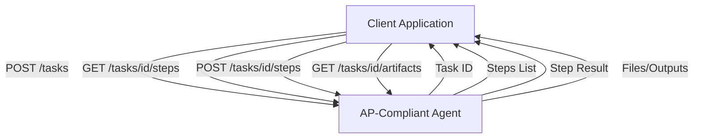

# Agent Protocol: Standardized API for AI Agents

The **Agent Protocol (AP)** is an open-source specification that defines a standard REST API for interacting with AI agents. Think of it as the "HTTP of agents" – a common interface that works regardless of the underlying agent implementation.

## Why Standardize?

### The Problem

Every agent framework has its own API:

```python
# LangChain
agent.invoke({"input": "..."})

# AutoGPT
agent.run(goal="...")

# Custom agents
agent.execute(task="...", config={...})
```

This fragmentation makes it hard to:
- Switch between agent implementations
- Build generic agent tooling
- Create marketplaces of agents

### The Solution

One standard API that all agents can implement:

```bash
# Works with ANY AP-compliant agent
curl -X POST http://agent:8000/ap/v1/agent/tasks \
  -H "Content-Type: application/json" \
  -d '{"input": "Write a Python script to sort a list"}'
```

---

## Core Concepts



### Tasks

A **Task** is the top-level work unit. It represents something the user wants the agent to accomplish.

```json
{
  "task_id": "task-abc123",
  "input": "Create a web scraper for news articles",
  "additional_input": {
    "target_sites": ["techcrunch.com", "wired.com"]
  },
  "created_at": "2024-03-30T10:00:00Z"
}
```

### Steps

A **Step** is an individual action within a task. The agent breaks down tasks into multiple steps.

```json
{
  "step_id": "step-001",
  "task_id": "task-abc123",
  "name": "Analyze website structure",
  "status": "completed",
  "output": "Found article containers at .post-card selectors",
  "is_last": false
}
```

### Artifacts

**Artifacts** are files or outputs produced by the agent during task execution.

```json
{
  "artifact_id": "artifact-xyz",
  "file_name": "scraper.py",
  "relative_path": "outputs/scraper.py",
  "created_at": "2024-03-30T10:05:00Z"
}
```

---

## API Reference

### Tasks Endpoints

| Method | Endpoint | Description |
| :--- | :--- | :--- |
| `POST` | `/ap/v1/agent/tasks` | Create a new task |
| `GET` | `/ap/v1/agent/tasks` | List all tasks |
| `GET` | `/ap/v1/agent/tasks/{task_id}` | Get task details |

### Steps Endpoints

| Method | Endpoint | Description |
| :--- | :--- | :--- |
| `GET` | `/ap/v1/agent/tasks/{task_id}/steps` | List all steps |
| `POST` | `/ap/v1/agent/tasks/{task_id}/steps` | Execute next step |
| `GET` | `/ap/v1/agent/tasks/{task_id}/steps/{step_id}` | Get step details |

### Artifacts Endpoints

| Method | Endpoint | Description |
| :--- | :--- | :--- |
| `GET` | `/ap/v1/agent/tasks/{task_id}/artifacts` | List artifacts |
| `POST` | `/ap/v1/agent/tasks/{task_id}/artifacts` | Upload artifact |
| `GET` | `/ap/v1/agent/tasks/{task_id}/artifacts/{artifact_id}` | Download artifact |

---

## Implementation Example

### Python Server (FastAPI)

```python
from fastapi import FastAPI
from pydantic import BaseModel
from uuid import uuid4

app = FastAPI()

# In-memory storage
tasks = {}
steps = {}

class TaskInput(BaseModel):
    input: str
    additional_input: dict = {}

class Task(BaseModel):
    task_id: str
    input: str
    status: str = "created"

class StepResult(BaseModel):
    step_id: str
    task_id: str
    name: str
    status: str
    output: str
    is_last: bool

@app.post("/ap/v1/agent/tasks")
async def create_task(task_input: TaskInput) -> Task:
    task_id = str(uuid4())
    task = Task(task_id=task_id, input=task_input.input)
    tasks[task_id] = task
    steps[task_id] = []
    return task

@app.get("/ap/v1/agent/tasks/{task_id}")
async def get_task(task_id: str) -> Task:
    return tasks[task_id]

@app.post("/ap/v1/agent/tasks/{task_id}/steps")
async def execute_step(task_id: str) -> StepResult:
    # Your agent logic here
    step_id = str(uuid4())
    step_count = len(steps[task_id])
    
    # Example: Simple echo agent
    result = StepResult(
        step_id=step_id,
        task_id=task_id,
        name=f"Step {step_count + 1}",
        status="completed",
        output=f"Processed: {tasks[task_id].input}",
        is_last=True  # Single-step agent
    )
    
    steps[task_id].append(result)
    return result

@app.get("/ap/v1/agent/tasks/{task_id}/steps")
async def list_steps(task_id: str) -> list[StepResult]:
    return steps[task_id]
```

### Client Usage

```python
import requests

BASE_URL = "http://localhost:8000"

# Create a task
response = requests.post(
    f"{BASE_URL}/ap/v1/agent/tasks",
    json={"input": "Summarize the latest AI news"}
)
task = response.json()
task_id = task["task_id"]

# Execute steps until complete
while True:
    step = requests.post(
        f"{BASE_URL}/ap/v1/agent/tasks/{task_id}/steps"
    ).json()
    
    print(f"Step: {step['name']}")
    print(f"Output: {step['output']}")
    
    if step["is_last"]:
        break

# Get all artifacts
artifacts = requests.get(
    f"{BASE_URL}/ap/v1/agent/tasks/{task_id}/artifacts"
).json()
```

---

## Integrating with Agent Frameworks

### LangChain Integration

```python
from langchain.agents import AgentExecutor
from agent_protocol import Agent, Step, Task

class LangChainAPAgent(Agent):
    def __init__(self, agent_executor: AgentExecutor):
        self.executor = agent_executor
        
    async def create_task(self, task: Task) -> Task:
        # Store task context
        return task
    
    async def execute_step(self, task: Task, step: Step) -> Step:
        result = self.executor.invoke({"input": task.input})
        step.output = result["output"]
        step.is_last = True
        return step
```

### AutoGPT Integration

```python
from autogpt import AutoGPT
from agent_protocol import Agent

class AutoGPTAPAgent(Agent):
    async def execute_step(self, task, step):
        # AutoGPT runs in a loop internally
        result = await self.autogpt.run_single_step()
        step.output = result.content
        step.is_last = result.is_complete
        return step
```

---

## Benefits of Agent Protocol

### 1. Interoperability

Switch agents without changing client code:

```python
# Same client works with different agents
agent_url = os.getenv("AGENT_URL")  # Could be any AP agent
client = AgentProtocolClient(agent_url)
```

### 2. Benchmarking

Run the same benchmarks across different agent implementations:

```python
agents = [
    "http://gpt4-agent:8000",
    "http://claude-agent:8000",
    "http://local-llama:8000"
]

for agent in agents:
    score = run_benchmark(agent, benchmark_suite)
    print(f"{agent}: {score}")
```

### 3. Agent Marketplace

Build platforms where users can discover and use different agents:

```python
# Unified interface to any registered agent
agent = marketplace.get_agent("code-writer-pro")
task = agent.create_task("Write a REST API in Go")
```

---

## Best Practices

### 1. Meaningful Step Names

```python
# ❌ Bad
step.name = "Step 1"

# ✅ Good
step.name = "Analyzing requirements"
step.name = "Generating code structure"
step.name = "Writing unit tests"
```

### 2. Structured Output

```python
# ❌ Bad
step.output = "Done"

# ✅ Good
step.output = json.dumps({
    "action": "file_created",
    "path": "src/api.py",
    "lines": 150,
    "summary": "Created REST API with 5 endpoints"
})
```

### 3. Progress Tracking

```python
step.additional_output = {
    "progress": 0.75,
    "estimated_remaining": "2 steps",
    "current_action": "Running tests"
}
```

---

## Ecosystem & Tools

| Tool | Description |
| :--- | :--- |
| **agent-protocol** | Official Python SDK |
| **ap-benchmark** | Standardized agent benchmarks |
| **ap-ui** | Web UI for any AP agent |
| **ap-proxy** | Load balancer for multiple agents |

---

## Conclusion

Agent Protocol brings order to the fragmented landscape of AI agents. By implementing AP, your agent becomes instantly compatible with the growing ecosystem of tools, benchmarks, and platforms built on this standard.

---
*Related: [Single-Agent Patterns](./single-agent-patterns) | [Multi-Agent Architectures](./multi-agent-architectures) | [Tool Use & Function Calling](./tool-use-function-calling)*
