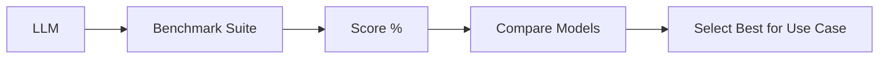
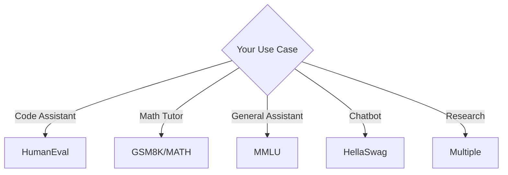

# LLM Benchmarks: Understanding MMLU, GSM8K, and More

When comparing language models, you'll encounter benchmark scores like "MMLU: 86.4%" or "GSM8K: 92%". But what do these numbers actually mean? This guide explains the major benchmarks and how to interpret them.

## Why Benchmarks Matter

Benchmarks provide **standardized comparisons** between models. Without them, we'd have no objective way to measure progress or choose between models for specific use cases.



---

## Major Benchmarks

### MMLU (Massive Multitask Language Understanding)

**What it measures**: Broad knowledge across 57 subjects

| Category | Example Subjects |
| :--- | :--- |
| STEM | Math, Physics, CS, Biology |
| Humanities | History, Philosophy, Law |
| Social Sciences | Economics, Psychology, Sociology |
| Other | Professional Medicine, Accounting |

**Format**: Multiple choice (A, B, C, D)

```
Question: What is the capital of Australia?
A) Sydney
B) Melbourne
C) Canberra  ← Correct
D) Perth
```

**Scoring**: % of correct answers

| Model | MMLU Score |
| :--- | :--- |
| GPT-4o | ~88% |
| Claude 3.5 Sonnet | ~88% |
| Llama 3.1 405B | ~87% |
| GPT-3.5 | ~70% |

**Limitations**:
- Multiple choice only (no generation)
- Static knowledge (can be memorized)
- English-centric

---

### GSM8K (Grade School Math)

**What it measures**: Mathematical reasoning (grade school level)

**Format**: Word problems requiring multi-step reasoning

```
Question: James decides to run 3 sprints 3 times a week. 
He runs 60 meters each sprint. How many total meters 
does he run a week?

Answer: 3 sprints × 3 times × 60 meters = 540 meters
```

**Scoring**: % with correct final answer

| Model | GSM8K Score |
| :--- | :--- |
| GPT-4o | ~95% |
| Claude 3.5 Sonnet | ~96% |
| Llama 3.1 70B | ~93% |

**Why it's important**: Tests **reasoning chains**, not just factual recall.

**Limitations**:
- Still relatively simple math
- Doesn't test advanced mathematics

---

### HumanEval (Coding)

**What it measures**: Code generation ability

**Format**: Function signature + docstring → generate implementation

```python
def has_close_elements(numbers: List[float], threshold: float) -> bool:
    """Check if in given list of numbers, are any two numbers 
    closer to each other than given threshold.
    >>> has_close_elements([1.0, 2.0, 3.0], 0.5)
    False
    >>> has_close_elements([1.0, 2.8, 3.0, 4.0, 5.0, 2.0], 0.3)
    True
    """
    # Model generates implementation here
```

**Scoring**: pass@k (% that pass unit tests, with k attempts)

| Model | HumanEval (pass@1) |
| :--- | :--- |
| GPT-4o | ~90% |
| Claude 3.5 Sonnet | ~92% |
| DeepSeek Coder | ~90% |

**Limitations**:
- Only Python
- Simple, self-contained functions
- Doesn't test debugging or large codebases

---

### HellaSwag (Commonsense)

**What it measures**: Commonsense reasoning about everyday situations

**Format**: Complete the sentence

```
A woman is outside with a bucket and a dog. The dog is running 
around trying to avoid a bath. She...

A) rinses the bucket out with soap.
B) uses a hose to wash the dog.  ← Correct
C) starts to teach the dog to sit.
D) walks into the living room.
```

**Scoring**: % correct

| Model | HellaSwag |
| :--- | :--- |
| GPT-4 | ~95% |
| Llama 3.1 | ~88% |

---

### MATH (Competition Math)

**What it measures**: Advanced mathematical problem-solving

**Levels**: 1 (easiest) to 5 (hardest) - competition difficulty

```
Problem: Let $a$ and $b$ be positive real numbers such that 
$a + b = 1$. Prove that $a^a b^b + a^b b^a \leq 1$.
```

**Scoring**: % correct (often with Chain-of-Thought)

| Model | MATH Score |
| :--- | :--- |
| GPT-4o + CoT | ~76% |
| Claude 3.5 | ~71% |
| o1-preview | ~94% |

---

### ARC (AI2 Reasoning Challenge)

**What it measures**: Science reasoning (grade school level)

**Variants**:
- ARC-Easy: Simpler questions
- ARC-Challenge: Harder, requires reasoning

```
Question: Which of these would let the most heat travel through?
A) a++metal+spoon+in+a+++of+hot+water
B) a+plastic+cup+of+cold+water
C) a+wooden+stick+in+a++of+hot+water
D) a+paper+cup+of+hot+water

Answer: A (metal conducts heat)
```

---

## Benchmark Comparison Table

| Benchmark | Tests | Format | Best For |
| :--- | :--- | :--- | :--- |
| **MMLU** | Knowledge | Multiple choice | General capability |
| **GSM8K** | Math reasoning | Word problems | Math tasks |
| **HumanEval** | Coding | Function generation | Code assistants |
| **HellaSwag** | Commonsense | Sentence completion | Conversational AI |
| **MATH** | Advanced math | Proofs/problems | Technical use |
| **ARC** | Science | Multiple choice | Educational tools |

---

## How to Use Benchmarks

### 1. Match Benchmark to Use Case



### 2. Consider the Gaps

> [!WARNING]
> Benchmarks don't measure everything. High MMLU doesn't guarantee:
> - Good instruction following
> - Appropriate safety behavior
> - Creative writing ability
> - Long-context performance

### 3. Watch for Data Contamination

Models trained on benchmark data may score artificially high. Look for:
- Held-out test sets
- New benchmarks the model hasn't seen
- Real-world evaluation alongside benchmarks

---

## Creating Custom Evaluations

For production use, build evaluations specific to your domain:

```python
from datasets import Dataset

# Create your own eval set
eval_data = [
    {
        "input": "Summarize this legal contract...",
        "expected_keywords": ["liability", "termination", "confidentiality"],
        "domain": "legal"
    },
    {
        "input": "What medication interactions should I warn about?",
        "expected_mentions": ["drug_a", "drug_b"],
        "domain": "medical"
    }
]

def evaluate_model(model, eval_set):
    scores = []
    for item in eval_set:
        response = model.generate(item["input"])
        score = grade_response(response, item)
        scores.append(score)
    return sum(scores) / len(scores)
```

---

## Emerging Benchmarks

| Benchmark | Focus |
| :--- | :--- |
| **GPQA** | PhD-level science questions |
| **SWE-bench** | Real GitHub issue resolution |
| **AgentBench** | Multi-step agent tasks |
| **MT-Bench** | Multi-turn conversation quality |
| **IFEval** | Instruction following precision |

---

## Conclusion

Benchmarks are useful signals, not absolute truths. Use them to:
1. **Narrow down** model candidates
2. **Identify strengths** (coding vs. reasoning vs. knowledge)
3. **Track progress** over time

But always validate with your **own evaluations** on your specific use case.

---
*Related: [Evaluation Guide](./evaluation-guide) | [LLM Red Teaming](./llm-red-teaming)*
