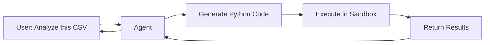

# Code Execution Skills for AI Agents

Code execution transforms agents from advisors into doers. Instead of just suggesting code, agents can run it, see results, and iterate. But with great power comes great responsibility – sandboxing is essential.

## Why Code Execution?



**Use cases**:
- Data analysis and visualization
- Mathematical calculations
- File format conversions
- API testing
- Prototype validation

---

## Sandboxing Options

| Solution | Isolation | Language Support | Latency | Cost |
| :--- | :--- | :--- | :--- | :--- |
| **Docker** | High | Any | Medium | Self-hosted |
| **Pyodide** | Medium | Python only | Low | Free |
| **E2B** | High | Any | Medium | Pay-per-use |
| **Modal** | High | Python | Low | Pay-per-use |
| **AWS Lambda** | High | Many | High | Pay-per-use |

---

## 1. Docker Containers

The most flexible and secure option for self-hosting.

### Basic Setup

```python
import docker
import tempfile
import os

client = docker.from_env()

def execute_python(code: str, timeout: int = 30) -> dict:
    """Execute Python code in isolated container"""
    
    # Write code to temp file
    with tempfile.NamedTemporaryFile(mode='w', suffix='.py', delete=False) as f:
        f.write(code)
        script_path = f.name
    
    try:
        result = client.containers.run(
            image="python:3.11-slim",
            command=f"python /script.py",
            volumes={script_path: {'bind': '/script.py', 'mode': 'ro'}},
            mem_limit="256m",
            cpu_period=100000,
            cpu_quota=50000,  # 50% CPU
            network_disabled=True,  # No network access
            remove=True,
            timeout=timeout
        )
        return {"success": True, "output": result.decode()}
    except docker.errors.ContainerError as e:
        return {"success": False, "error": e.stderr.decode()}
    except Exception as e:
        return {"success": False, "error": str(e)}
    finally:
        os.unlink(script_path)
```

### Custom Image with Libraries

```dockerfile
# Dockerfile.sandbox
FROM python:3.11-slim

RUN pip install --no-cache-dir \
    pandas \
    numpy \
    matplotlib \
    requests \
    scikit-learn

# Non-root user for security
RUN useradd -m sandbox
USER sandbox
WORKDIR /home/sandbox
```

```bash
docker build -t code-sandbox -f Dockerfile.sandbox .
```

### Security Hardening

```python
def run_sandboxed(code: str) -> dict:
    return client.containers.run(
        image="code-sandbox",
        command=f"python -c '{code}'",
        # Security settings
        network_disabled=True,
        read_only=True,
        mem_limit="512m",
        pids_limit=50,
        security_opt=["no-new-privileges"],
        cap_drop=["ALL"],
        # Resource limits
        cpu_period=100000,
        cpu_quota=25000,
        # Cleanup
        remove=True,
        timeout=30
    )
```

---

## 2. Pyodide (Browser Python)

Python compiled to WebAssembly. Runs in browser or Node.js.

### In Browser

```html
<script src="https://cdn.jsdelivr.net/pyodide/v0.24.1/full/pyodide.js"></script>
<script>
async function runPython(code) {
    const pyodide = await loadPyodide();
    await pyodide.loadPackage(['numpy', 'pandas']);
    return pyodide.runPython(code);
}
</script>
```

### In Node.js

```javascript
const { loadPyodide } = require("pyodide");

async function executePython(code) {
    const pyodide = await loadPyodide();
    
    try {
        const result = pyodide.runPython(code);
        return { success: true, output: result };
    } catch (error) {
        return { success: false, error: error.message };
    }
}
```

### Limitations

- No file system access (virtual FS only)
- No network access
- Limited library support
- Single-threaded

**Best for**: Quick calculations, data transformations, education

---

## 3. E2B (Cloud Sandbox)

Managed code execution service with pre-built AI agent integrations.

### Setup

```bash
pip install e2b-code-interpreter
```

### Usage

```python
from e2b_code_interpreter import Sandbox

sandbox = Sandbox()

# Execute code
execution = sandbox.run_code("print('Hello, World!')")
print(execution.text)  # "Hello, World!"

# With file upload
sandbox.files.write("/data/input.csv", csv_content)
execution = sandbox.run_code("""
import pandas as pd
df = pd.read_csv('/data/input.csv')
print(df.describe())
""")

# Download results
result_file = sandbox.files.read("/data/output.png")

sandbox.close()
```

### Integration with OpenAI

```python
from openai import OpenAI
from e2b_code_interpreter import Sandbox

client = OpenAI()
sandbox = Sandbox()

def code_interpreter_tool(code: str) -> str:
    """Execute code and return result"""
    execution = sandbox.run_code(code)
    
    if execution.error:
        return f"Error: {execution.error}"
    
    result = execution.text
    
    # Handle plots
    for artifact in execution.artifacts:
        if artifact.type == "image":
            result += f"\n[Generated image: {artifact.name}]"
    
    return result

# Use as tool in conversation loop
```

---

## 4. Modal (Serverless Python)

Cloud functions with GPU support.

```python
import modal

app = modal.App("code-executor")

@app.function(
    image=modal.Image.debian_slim().pip_install("pandas", "numpy"),
    timeout=60,
    memory=512
)
def execute_code(code: str) -> dict:
    import sys
    from io import StringIO
    
    old_stdout = sys.stdout
    sys.stdout = mystdout = StringIO()
    
    try:
        exec(code)
        output = mystdout.getvalue()
        return {"success": True, "output": output}
    except Exception as e:
        return {"success": False, "error": str(e)}
    finally:
        sys.stdout = old_stdout

# Call from agent
with app.run():
    result = execute_code.remote("print(2 + 2)")
```

---

## Agent Tool Pattern

```python
code_execution_tool = {
    "name": "execute_python",
    "description": "Execute Python code in a sandboxed environment. Use for calculations, data analysis, or generating visualizations. Code runs with pandas, numpy, and matplotlib available.",
    "parameters": {
        "type": "object",
        "properties": {
            "code": {
                "type": "string",
                "description": "Python code to execute. Use print() for output."
            }
        },
        "required": ["code"]
    }
}

def handle_code_execution(code: str) -> str:
    # Validate before executing
    if contains_dangerous_patterns(code):
        return "Error: Code contains forbidden patterns"
    
    result = sandbox.run_code(code)
    
    if result["success"]:
        return f"Output:\n{result['output']}"
    else:
        return f"Error:\n{result['error']}"
```

---

## Security Best Practices

> [!CAUTION]
> Never execute LLM-generated code without sandboxing. Models can be manipulated into generating malicious code.

### 1. Code Validation

```python
import ast

FORBIDDEN_IMPORTS = {'os', 'subprocess', 'sys', 'socket', 'requests'}

def validate_code(code: str) -> tuple[bool, str]:
    try:
        tree = ast.parse(code)
    except SyntaxError as e:
        return False, f"Syntax error: {e}"
    
    for node in ast.walk(tree):
        if isinstance(node, ast.Import):
            for alias in node.names:
                if alias.name in FORBIDDEN_IMPORTS:
                    return False, f"Forbidden import: {alias.name}"
        elif isinstance(node, ast.ImportFrom):
            if node.module in FORBIDDEN_IMPORTS:
                return False, f"Forbidden import: {node.module}"
    
    return True, "Valid"
```

### 2. Resource Limits

```python
LIMITS = {
    "max_execution_time": 30,  # seconds
    "max_memory": "512m",
    "max_output_size": 10000,  # characters
    "max_file_size": "10m"
}
```

### 3. Output Sanitization

```python
def sanitize_output(output: str, max_length: int = 5000) -> str:
    """Truncate and clean output for LLM consumption"""
    if len(output) > max_length:
        return output[:max_length] + "\n\n[Output truncated...]"
    return output
```

### 4. No Persistence

```python
# Each execution gets fresh container
# No state persists between runs
# Filesystem is ephemeral
```

---

## Handling Errors

```python
def run_with_retry(code: str, max_retries: int = 2) -> dict:
    """Execute code with automatic retry on failure"""
    
    for attempt in range(max_retries + 1):
        result = execute_code(code)
        
        if result["success"]:
            return result
        
        if attempt < max_retries:
            # Let LLM fix the error
            fixed_code = llm.generate(
                f"Fix this Python code error:\n\n"
                f"Code:\n{code}\n\n"
                f"Error:\n{result['error']}"
            )
            code = fixed_code
    
    return result
```

---

## Comparison Table

| Feature | Docker | Pyodide | E2B | Modal |
| :--- | :--- | :--- | :--- | :--- |
| **Isolation** | ✅ High | ⚠️ Medium | ✅ High | ✅ High |
| **Setup** | Medium | Easy | Easy | Easy |
| **Cost** | Self-host | Free | Pay-per-use | Pay-per-use |
| **GPU Support** | ✅ | ❌ | ✅ | ✅ |
| **File Handling** | ✅ | Limited | ✅ | ✅ |
| **Network** | Configurable | ❌ | ✅ | ✅ |
| **Latency** | ~500ms | ~100ms | ~1s | ~500ms |

---

## Conclusion

Code execution is a powerful agent skill but requires careful sandboxing. Start with Pyodide for simple use cases, graduate to Docker for full control, or use E2B/Modal for managed infrastructure.

---
*Related: [Tool Use & Function Calling](./tool-use-function-calling) | [Data Analysis Skills](./data-analysis-skills)*
