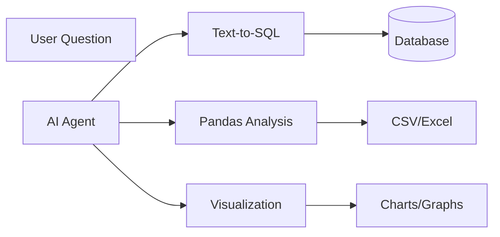

# Data Analysis Skills for AI Agents

Data analysis is one of the most valuable agent capabilities. Agents that can query databases, analyze spreadsheets, and generate visualizations unlock productivity gains for non-technical users.

## Core Capabilities



---

## 1. Text-to-SQL

Convert natural language questions into SQL queries.

### Basic Implementation

```python
def text_to_sql(question: str, schema: str) -> str:
    prompt = f"""Given this database schema:
{schema}

Convert this question to SQL:
"{question}"

Return only the SQL query."""

    return llm.generate(prompt).strip()
```

### Schema Representation

```python
def get_schema_for_llm(database) -> str:
    schema_text = []
    for table in database.tables:
        columns = [f"  - {col.name} ({col.type})" for col in table.columns]
        schema_text.append(f"Table: {table.name}\n" + "\n".join(columns))
    return "\n\n".join(schema_text)
```

### Safe Query Execution

```python
def execute_sql(db_path: str, query: str, max_rows: int = 100) -> dict:
    # Block dangerous keywords
    forbidden = ["DROP", "DELETE", "UPDATE", "INSERT", "ALTER"]
    if any(kw in query.upper() for kw in forbidden):
        return {"error": "Forbidden operation"}
    
    conn = sqlite3.connect(f"file:{db_path}?mode=ro", uri=True)
    cursor = conn.execute(query)
    columns = [desc[0] for desc in cursor.description]
    rows = cursor.fetchmany(max_rows)
    return {"columns": columns, "rows": rows}
```

---

## 2. Pandas Data Analysis

### Code Generation Approach

```python
def analyze_dataframe(df_info: str, question: str) -> str:
    prompt = f"""Given a DataFrame:
{df_info}

Write Python code to answer: "{question}"
Assume DataFrame is loaded as `df`. Use print() for output."""

    return llm.generate(prompt)
```

### DataFrame Info for LLM

```python
def get_df_info(df: pd.DataFrame) -> str:
    info = [f"Shape: {df.shape[0]} rows × {df.shape[1]} columns"]
    for col in df.columns:
        sample = df[col].dropna().head(3).tolist()
        info.append(f"  - {col} ({df[col].dtype}): e.g., {sample}")
    return "\n".join(info)
```

---

## 3. Visualization Generation

```python
def generate_chart(df: pd.DataFrame, chart_spec: dict) -> str:
    import matplotlib.pyplot as plt
    
    fig, ax = plt.subplots(figsize=(10, 6))
    df.plot(kind=chart_spec["type"], x=chart_spec["x"], 
            y=chart_spec["y"], ax=ax)
    ax.set_title(chart_spec.get("title", "Chart"))
    
    output_path = f"/tmp/chart_{uuid4()}.png"
    plt.savefig(output_path, dpi=150, bbox_inches="tight")
    plt.close()
    return output_path
```

---

## Agent Tools Definition

```python
data_analysis_tools = [
    {
        "name": "query_data",
        "description": "Query a CSV/Excel file using natural language.",
        "parameters": {
            "type": "object",
            "properties": {
                "file_path": {"type": "string"},
                "question": {"type": "string"}
            },
            "required": ["file_path", "question"]
        }
    },
    {
        "name": "create_chart",
        "description": "Create a visualization from data.",
        "parameters": {
            "type": "object",
            "properties": {
                "file_path": {"type": "string"},
                "chart_type": {"type": "string", "enum": ["bar", "line", "scatter", "pie"]},
                "x_column": {"type": "string"},
                "y_column": {"type": "string"}
            },
            "required": ["file_path", "chart_type", "x_column", "y_column"]
        }
    }
]
```

---

## Best Practices

1. **Schema Caching**: Cache database schemas to avoid repeated introspection
2. **Result Size Limits**: Cap results to prevent overwhelming LLM context
3. **Error Recovery**: Feed SQL errors back to LLM for self-correction
4. **Read-Only Access**: Use read-only database connections

---

## Conclusion

Data analysis skills make agents genuinely useful for business users. Start with read-only SQL queries, add Pandas for complex transformations, and layer in visualization for compelling outputs.

---
*Related: [Code Execution Skills](./code-execution-skills) | [Structured Outputs](./structured-outputs)*
