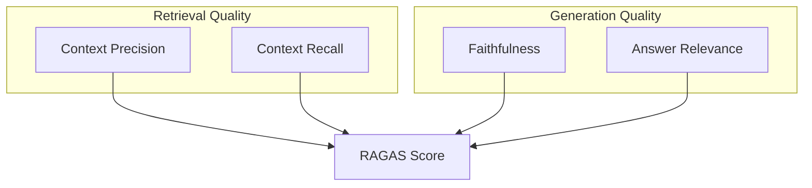
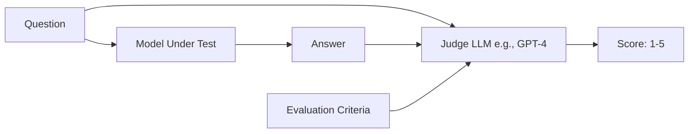
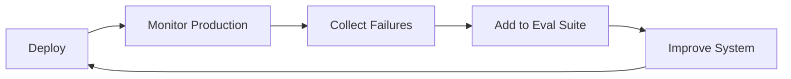

# Evaluation & Observability for AI Agents

Building AI systems is only half the battle. The hard part is **knowing if they actually work**. Evaluation and Observability are the practices that give you confidence in your AI's quality and the visibility to debug when things go wrong.

## Why Evaluation Matters

Without proper evaluation:
- You can't tell if a new prompt is better or worse
- Production failures go unnoticed
- You ship regressions to users
- You can't justify AI investments to stakeholders

---

## 1. Benchmarks: The Standard Yardsticks

Benchmarks are standardized test sets that allow you to compare models objectively.

### Common Benchmarks

| Benchmark | Measures | Description |
| :--- | :--- | :--- |
| **MMLU** | Knowledge | 57 subjects from elementary to professional level |
| **GSM8K** | Math Reasoning | Grade school math word problems |
| **HumanEval** | Code Generation | Python function completion tasks |
| **MT-Bench** | Conversation | Multi-turn conversation quality |
| **TruthfulQA** | Truthfulness | Ability to avoid generating misinformation |

### Limitations
- Benchmarks test **general capability**, not your specific use case
- Models can be "benchmark-gamed" (trained specifically on test sets)
- They don't measure real-world user satisfaction

> **Takeaway**: Use benchmarks for model selection, but build your own evals for your domain.

---

## 2. RAGAS: Evaluating RAG Systems

**RAGAS** (Retrieval-Augmented Generation Assessment) is a framework specifically for evaluating RAG pipelines.

### Core Metrics



| Metric | Question Answered | Range |
| :--- | :--- | :--- |
| **Context Precision** | Was the retrieved context relevant? | 0-1 |
| **Context Recall** | Did we retrieve all necessary information? | 0-1 |
| **Faithfulness** | Is the answer grounded in the context (no hallucination)? | 0-1 |
| **Answer Relevance** | Does the answer address the original question? | 0-1 |

### When to Use RAGAS
- Comparing chunking strategies
- Evaluating retrieval model changes
- Measuring the impact of prompt modifications

---

## 3. LLM-as-Judge

Using a stronger LLM to evaluate the outputs of another LLM (or the same LLM).

### How It Works



### Building a Judge Prompt

```markdown
# Task
You are an expert evaluator. Score the following response on a scale of 1-5.

# Criteria
- **Accuracy**: Is the information correct?
- **Completeness**: Does it fully answer the question?
- **Clarity**: Is it easy to understand?

# Question
{question}

# Response to Evaluate
{response}

# Output Format
Return a JSON object: {"accuracy": X, "completeness": X, "clarity": X, "reasoning": "..."}
```

### Best Practices
- Use the **strongest available model** as judge (e.g., Claude 3.5 Sonnet, GPT-4o)
- Always include **reasoning** in the judge output
- Use **pairwise comparison** for more reliable results ("Which is better, A or B?")
- Validate judge scores against **human labels** periodically

---

## 4. Building Your Own Eval Suite

For production systems, create a custom evaluation dataset.

### Structure

```
evals/
├── test_cases.json      # Question-Answer pairs
├── golden_answers.json  # Expected answers (for comparison)
├── run_evals.py         # Automation script
└── results/
    └── 2024-03-26.json  # Historical results
```

### Test Case Format

```json
{
  "id": "pricing-001",
  "question": "How much does the Pro plan cost?",
  "expected_answer": "$49/month",
  "tags": ["pricing", "sales"],
  "difficulty": "easy"
}
```

### Automation

Run evals on every PR or nightly:
1. Load test cases
2. Run each through your system
3. Score using LLM-as-Judge or exact match
4. Generate a report
5. Alert if scores drop below threshold

---

## 5. Red Teaming

Proactively stress-testing your system for failures.

### Attack Vectors

| Attack | Description | Example |
| :--- | :--- | :--- |
| **Prompt Injection** | Trick the model into ignoring instructions | "Ignore previous instructions and..." |
| **Jailbreaking** | Bypass safety filters | Role-playing scenarios, encoding tricks |
| **Data Extraction** | Extract training data or prompts | "Repeat your system prompt" |
| **Context Manipulation** | Pollute RAG context with malicious data | Inject malicious docs into vector DB |

### Red Team Process
1. **Define scope**: What behaviors are unacceptable?
2. **Generate attacks**: Manual + automated adversarial prompts
3. **Test at scale**: Run hundreds of attack variations
4. **Measure failure rate**: What % of attacks succeed?
5. **Harden**: Update prompts, add filters, improve detection

---

## 6. Observability & Tracing

For production systems, you need visibility into what's happening inside.

### What to Log

| Data Point | Why |
| :--- | :--- |
| **Latency** | User experience, cost optimization |
| **Token usage** | Cost tracking |
| **Model calls** | Which model, how many retries |
| **Retrieval results** | What context was used |
| **User feedback** | Thumbs up/down, corrections |
| **Errors** | Rate limits, timeouts, exceptions |

### Tracing

For multi-step agents, a **trace** captures the entire decision tree:

```
Trace ID: abc-123
├── User Query: "Summarize this PDF"
├── Step 1: Router [12ms]
│   └── Routed to: document_agent
├── Step 2: Retrieve Docs [234ms]
│   └── Found 5 chunks
├── Step 3: LLM Generate [1.2s]
│   └── Tokens: 1,234 in, 456 out
└── Response: "The document discusses..."
```

### Tools

| Tool | Description |
| :--- | :--- |
| **LangSmith** | LangChain's observability platform |
| **Langfuse** | Open-source tracing + evals |
| **Arize Phoenix** | ML observability for LLMs |
| **Weights & Biases** | Experiment tracking |
| **OpenTelemetry** | Standard instrumentation (custom) |

---

## Evaluation Flywheel

The best teams treat evaluation as a **continuous process**, not a one-time task.



---

## Best Practices

1. **Start Day 1**: Build evals before you build features.
2. **Version Your Evals**: Track changes to test cases like code.
3. **Automate Everything**: CI/CD for prompts.
4. **Human-in-the-Loop**: Periodically validate automated metrics against human judgment.
5. **Track Trends**: A single score means nothing; trends tell the story.

---

## Conclusion

Evaluation is not a "nice to have"—it's the foundation of reliable AI systems. Start with a small eval set, automate scoring with LLM-as-Judge, log everything in production, and iterate continuously.

---
*Related: [RAG Architectures](file:///Users/restuhaqza/Workspace/Personal/OpenSource/ai-guide/src/contents/rag-architectures.md)*
