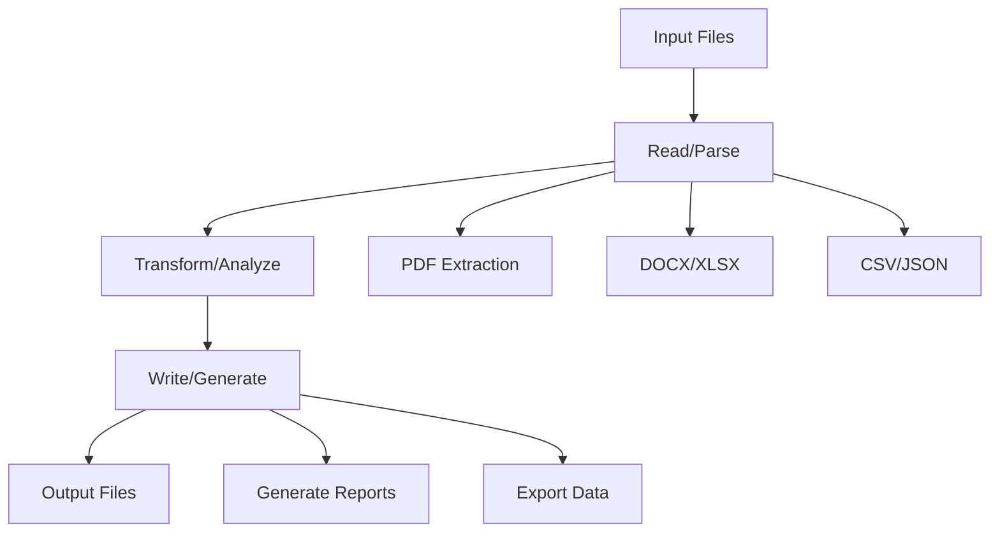

# File Manipulation Skills for AI Agents

File manipulation is essential for document processing agents. From extracting text from PDFs to generating reports, agents need reliable tools to work with various file formats.

## Common File Operations



---

## Reading Files

### PDF Extraction

#### PyMuPDF (fitz) - Fast & Accurate

```python
import fitz  # PyMuPDF

def extract_pdf_text(file_path: str) -> str:
    doc = fitz.open(file_path)
    text = ""
    for page in doc:
        text += page.get_text()
    return text

def extract_pdf_with_structure(file_path: str) -> dict:
    """Extract text with page-level structure"""
    doc = fitz.open(file_path)
    pages = []
    for i, page in enumerate(doc):
        pages.append({
            "page_number": i + 1,
            "text": page.get_text(),
            "tables": extract_tables(page)  # If needed
        })
    return {"pages": pages, "total_pages": len(doc)}
```

#### pdfplumber - Better for Tables

```python
import pdfplumber

def extract_pdf_tables(file_path: str) -> list[list]:
    tables = []
    with pdfplumber.open(file_path) as pdf:
        for page in pdf.pages:
            page_tables = page.extract_tables()
            tables.extend(page_tables)
    return tables
```

#### OCR for Scanned PDFs

```python
import pytesseract
from pdf2image import convert_from_path

def ocr_pdf(file_path: str) -> str:
    images = convert_from_path(file_path)
    text = ""
    for image in images:
        text += pytesseract.image_to_string(image)
    return text
```

---

### Word Documents (DOCX)

```python
from docx import Document

def read_docx(file_path: str) -> str:
    doc = Document(file_path)
    paragraphs = [p.text for p in doc.paragraphs]
    return "\n".join(paragraphs)

def read_docx_structured(file_path: str) -> dict:
    doc = Document(file_path)
    content = {
        "paragraphs": [p.text for p in doc.paragraphs],
        "tables": [],
        "headers": []
    }
    
    for table in doc.tables:
        rows = []
        for row in table.rows:
            cells = [cell.text for cell in row.cells]
            rows.append(cells)
        content["tables"].append(rows)
    
    return content
```

---

### Excel Files (XLSX)

```python
import pandas as pd

def read_excel(file_path: str, sheet_name: str = None) -> dict:
    if sheet_name:
        df = pd.read_excel(file_path, sheet_name=sheet_name)
        return df.to_dict(orient="records")
    else:
        # Read all sheets
        sheets = pd.read_excel(file_path, sheet_name=None)
        return {name: df.to_dict(orient="records") 
                for name, df in sheets.items()}

def excel_to_markdown(file_path: str) -> str:
    df = pd.read_excel(file_path)
    return df.to_markdown()
```

---

### CSV Files

```python
import pandas as pd
import csv

def read_csv(file_path: str) -> list[dict]:
    df = pd.read_csv(file_path)
    return df.to_dict(orient="records")

def read_csv_safe(file_path: str, max_rows: int = 1000) -> dict:
    """Read CSV with limits for LLM consumption"""
    df = pd.read_csv(file_path, nrows=max_rows)
    return {
        "columns": list(df.columns),
        "row_count": len(df),
        "sample": df.head(10).to_dict(orient="records"),
        "dtypes": df.dtypes.astype(str).to_dict()
    }
```

---

### JSON Files

```python
import json

def read_json(file_path: str) -> dict:
    with open(file_path, 'r') as f:
        return json.load(f)

def read_jsonl(file_path: str) -> list[dict]:
    """Read JSON Lines format"""
    records = []
    with open(file_path, 'r') as f:
        for line in f:
            records.append(json.loads(line))
    return records
```

---

## Writing Files

### Generate PDF Reports

```python
from reportlab.lib.pagesizes import letter
from reportlab.pdfgen import canvas

def create_pdf_report(output_path: str, title: str, content: str):
    c = canvas.Canvas(output_path, pagesize=letter)
    c.setFont("Helvetica-Bold", 16)
    c.drawString(72, 750, title)
    
    c.setFont("Helvetica", 12)
    y = 720
    for line in content.split('\n'):
        c.drawString(72, y, line)
        y -= 15
        if y < 72:
            c.showPage()
            y = 750
    
    c.save()
```

### Generate Word Documents

```python
from docx import Document
from docx.shared import Inches

def create_docx(output_path: str, title: str, sections: list[dict]):
    doc = Document()
    doc.add_heading(title, 0)
    
    for section in sections:
        doc.add_heading(section["heading"], level=1)
        doc.add_paragraph(section["content"])
        
        if "table" in section:
            table = doc.add_table(rows=1, cols=len(section["table"]["headers"]))
            hdr_cells = table.rows[0].cells
            for i, header in enumerate(section["table"]["headers"]):
                hdr_cells[i].text = header
            
            for row_data in section["table"]["rows"]:
                row_cells = table.add_row().cells
                for i, cell in enumerate(row_data):
                    row_cells[i].text = str(cell)
    
    doc.save(output_path)
```

### Export to CSV/Excel

```python
def write_csv(data: list[dict], output_path: str):
    df = pd.DataFrame(data)
    df.to_csv(output_path, index=False)

def write_excel(data: dict[str, list[dict]], output_path: str):
    """Write multiple sheets"""
    with pd.ExcelWriter(output_path) as writer:
        for sheet_name, sheet_data in data.items():
            df = pd.DataFrame(sheet_data)
            df.to_excel(writer, sheet_name=sheet_name, index=False)
```

---

## Agent Tool Definitions

```python
file_tools = [
    {
        "name": "read_file",
        "description": "Read content from a file. Supports PDF, DOCX, CSV, JSON, and plain text.",
        "parameters": {
            "type": "object",
            "properties": {
                "file_path": {"type": "string", "description": "Path to the file"},
                "file_type": {"type": "string", "enum": ["pdf", "docx", "csv", "json", "txt"]}
            },
            "required": ["file_path"]
        }
    },
    {
        "name": "write_file",
        "description": "Write content to a file.",
        "parameters": {
            "type": "object",
            "properties": {
                "file_path": {"type": "string"},
                "content": {"type": "string"},
                "file_type": {"type": "string", "enum": ["txt", "json", "csv", "md"]}
            },
            "required": ["file_path", "content"]
        }
    },
    {
        "name": "convert_file",
        "description": "Convert a file from one format to another.",
        "parameters": {
            "type": "object",
            "properties": {
                "input_path": {"type": "string"},
                "output_path": {"type": "string"},
                "output_format": {"type": "string", "enum": ["pdf", "docx", "csv", "json", "md"]}
            },
            "required": ["input_path", "output_path", "output_format"]
        }
    }
]
```

---

## File Handler Implementation

```python
class FileHandler:
    READERS = {
        ".pdf": extract_pdf_text,
        ".docx": read_docx,
        ".xlsx": read_excel,
        ".csv": read_csv,
        ".json": read_json,
        ".txt": lambda p: open(p).read()
    }
    
    def read(self, file_path: str) -> str:
        ext = Path(file_path).suffix.lower()
        if ext not in self.READERS:
            raise ValueError(f"Unsupported file type: {ext}")
        
        content = self.READERS[ext](file_path)
        
        # Convert to string for LLM
        if isinstance(content, (dict, list)):
            return json.dumps(content, indent=2)
        return content
    
    def write(self, file_path: str, content: str) -> str:
        ext = Path(file_path).suffix.lower()
        
        if ext == ".json":
            with open(file_path, 'w') as f:
                json.dump(json.loads(content), f, indent=2)
        elif ext == ".csv":
            data = json.loads(content)
            write_csv(data, file_path)
        else:
            with open(file_path, 'w') as f:
                f.write(content)
        
        return f"Written to {file_path}"
```

---

## Security Best Practices

> [!WARNING]
> File operations can be dangerous. Always validate paths and content.

### 1. Path Traversal Prevention

```python
from pathlib import Path

ALLOWED_DIR = Path("/app/workspace")

def safe_path(user_path: str) -> Path:
    """Resolve and validate path is within allowed directory"""
    # Resolve to absolute path
    resolved = (ALLOWED_DIR / user_path).resolve()
    
    # Check it's still within allowed directory
    if not str(resolved).startswith(str(ALLOWED_DIR)):
        raise ValueError("Path traversal detected")
    
    return resolved
```

### 2. File Size Limits

```python
MAX_FILE_SIZE = 10 * 1024 * 1024  # 10 MB

def validate_file(file_path: str) -> bool:
    size = Path(file_path).stat().st_size
    if size > MAX_FILE_SIZE:
        raise ValueError(f"File too large: {size} bytes")
    return True
```

### 3. Content Type Validation

```python
import magic

ALLOWED_TYPES = [
    "application/pdf",
    "application/vnd.openxmlformats-officedocument.wordprocessingml.document",
    "text/csv",
    "application/json",
    "text/plain"
]

def validate_content_type(file_path: str) -> bool:
    mime = magic.from_file(file_path, mime=True)
    if mime not in ALLOWED_TYPES:
        raise ValueError(f"Unsupported file type: {mime}")
    return True
```

### 4. Sanitize Output for LLM

```python
def prepare_for_llm(content: str, max_chars: int = 20000) -> str:
    """Truncate and clean content for LLM consumption"""
    if len(content) > max_chars:
        return content[:max_chars] + "\n\n[Content truncated...]"
    return content
```

---

## Common Patterns

### Document Summarization

```python
async def summarize_document(file_path: str) -> str:
    content = file_handler.read(file_path)
    content = prepare_for_llm(content)
    
    response = await llm.generate(
        f"Summarize this document:\n\n{content}"
    )
    return response
```

### Data Extraction

```python
async def extract_entities(file_path: str, schema: dict) -> dict:
    content = file_handler.read(file_path)
    
    response = await llm.generate_structured(
        prompt=f"Extract information from this document:\n\n{content}",
        schema=schema
    )
    return response
```

### Batch Processing

```python
async def process_folder(folder_path: str) -> list[dict]:
    results = []
    for file in Path(folder_path).glob("*.pdf"):
        try:
            summary = await summarize_document(str(file))
            results.append({"file": file.name, "summary": summary})
        except Exception as e:
            results.append({"file": file.name, "error": str(e)})
    return results
```

---

## Conclusion

Robust file handling expands what agents can accomplish. Start with read-only operations, add writing with careful validation, and always enforce path and size limits.

---
*Related: [Data Analysis Skills](./data-analysis-skills) | [Code Execution Skills](./code-execution-skills)*
