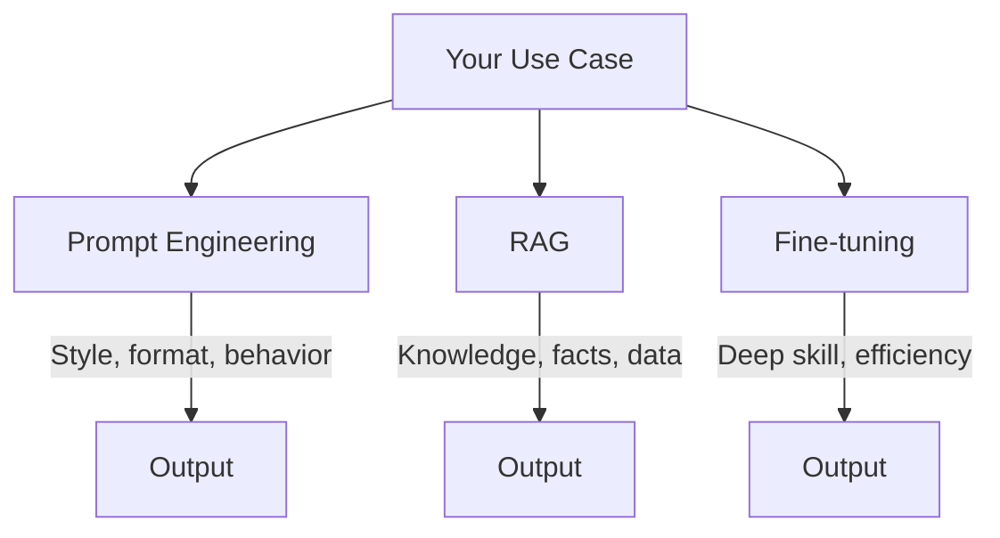
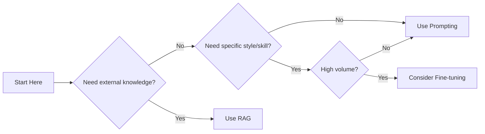

# Fine-tuning vs Context: When to Train vs When to Prompt

One of the most common questions in LLM development: should you fine-tune a model, use RAG, or just write better prompts? This guide provides a framework for making that decision.

## The Three Approaches



---

## Quick Decision Matrix

| Criteria | Prompting | RAG | Fine-tuning |
| :--- | :--- | :--- | :--- |
| **Setup time** | Minutes | Hours | Days |
| **Cost** | Tokens only | Tokens + infra | Training + inference |
| **Knowledge updates** | Instant | Fast | Requires retraining |
| **Latency** | Baseline | +retrieval time | Baseline or lower |
| **Best for** | Format/style | External knowledge | Specialized skill |

---

## When to Use Each

### Prompt Engineering

**Use when**:
- Changing output format or style
- Adding constraints or rules
- Few-shot examples are sufficient
- You need to iterate quickly

```python
# Example: Output formatting via prompts
prompt = """You are a technical writer.
Format all responses as:
1. Summary (1-2 sentences)
2. Key Points (bullet list)
3. Next Steps (if applicable)

User question: {question}"""
```

**Limitations**:
- Context window limits
- Inconsistent with complex rules
- No new knowledge

---

### RAG (Retrieval-Augmented Generation)

**Use when**:
- Knowledge changes frequently
- You have proprietary documents
- Answers should cite sources
- You need factual accuracy

```python
# Example: RAG for documentation
def answer_with_docs(question: str) -> str:
    docs = retriever.search(question, k=5)
    context = "\n".join([d.content for d in docs])
    
    return llm.generate(
        f"Using these sources:\n{context}\n\n"
        f"Answer: {question}"
    )
```

**Limitations**:
- Retrieval quality matters
- Adds latency
- Complex for multi-hop reasoning

---

### Fine-tuning

**Use when**:
- You need a specific skill deeply embedded
- Consistent style across millions of calls
- Cost optimization at scale
- Domain-specific terminology

```python
# Fine-tuning examples format
training_data = [
    {
        "messages": [
            {"role": "system", "content": "You are a legal assistant"},
            {"role": "user", "content": "Summarize this contract clause..."},
            {"role": "assistant", "content": "This clause establishes..."}
        ]
    },
    # Hundreds to thousands of examples
]
```

**Limitations**:
- Requires quality training data
- Expensive to iterate
- Can degrade general capabilities
- Knowledge cutoff still applies

---

## Decision Framework

### Step 1: Define What You Need

| Need | Solution |
| :--- | :--- |
| Different output format | Prompting |
| Access to private data | RAG |
| Consistent specialized behavior | Fine-tuning |
| Real-time information | RAG + web search |
| Cost efficiency at scale | Fine-tuning |

### Step 2: Evaluate Tradeoffs



### Step 3: Start Simple

> [!TIP]
> Always start with prompting. Only escalate when you hit clear limitations.

**Escalation ladder**:
1. **Prompting** → Hit context limits or inconsistency?
2. **RAG** → Need external knowledge or citations?
3. **Fine-tuning** → Need consistent specialized behavior at scale?

---

## Hybrid Approaches

In practice, most production systems combine approaches.

### RAG + Fine-tuning

Fine-tune for style, RAG for knowledge:

```python
# Fine-tuned model for medical terminology
# RAG for latest research papers
def medical_assistant(question: str) -> str:
    papers = retriever.search(question)
    
    return fine_tuned_model.generate(
        f"Based on these papers: {papers}\n"
        f"Answer in clinical terminology: {question}"
    )
```

### Prompting + RAG

Most common production pattern:

```python
system_prompt = """You are a helpful customer support agent.
Rules:
- Always cite policy documents
- Escalate billing issues to humans
- Be empathetic but concise"""

def support_agent(question: str) -> str:
    policies = retriever.search(question)
    
    return llm.generate(
        system_prompt + f"\n\nRelevant policies:\n{policies}\n\n"
        f"Customer: {question}"
    )
```

---

## Cost Comparison

### Scenario: 1M requests/month

| Approach | Setup Cost | Monthly Cost | Notes |
| :--- | :--- | :--- | :--- |
| **GPT-4o prompting** | $0 | ~$15,000 | At $0.015/1K output tokens |
| **RAG + GPT-4o-mini** | $500 | ~$2,000 | Vector DB + cheap model |
| **Fine-tuned 3.5** | $1,000 | ~$4,000 | Training + inference |
| **Self-hosted Llama** | $5,000 | ~$800 | GPU server costs |

---

## When Fine-tuning Wins

✅ Use fine-tuning when:
- You have 500+ high-quality examples
- Behavior needs to be deeply consistent
- Processing 100K+ requests/month
- Latency is critical (fine-tuned small model > large model)

❌ Avoid fine-tuning when:
- Knowledge changes monthly
- You need to trace answers to sources
- You're still iterating on requirements

---

## Conclusion

| Approach | Best For | Start When |
| :--- | :--- | :--- |
| **Prompting** | Format, style, quick iteration | Always start here |
| **RAG** | Private/changing knowledge | Need external facts |
| **Fine-tuning** | Specialized skill at scale | 100K+ similar tasks |

Most production systems use prompting + RAG. Fine-tuning is the optimization step for proven use cases.

---
*Related: [RAG Architectures](./rag-architectures) | [Embeddings Guide](./embeddings-guide)*
