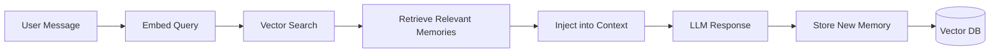

# Memory Systems for AI Agents

One of the key limitations of LLMs is their **stateless nature**. Each conversation starts fresh—the model has no memory of past interactions. Memory Systems solve this by giving agents the ability to remember, learn, and evolve over time.

## Why Memory Matters

Without memory, agents:
- Repeat mistakes they've made before
- Ask users for the same information repeatedly
- Cannot learn user preferences
- Lose context in long-running tasks

With memory, agents become **personalized**, **consistent**, and **more intelligent**.

---

## 1. Short-Term Memory (Context Window)

The most basic "memory" is the **context window** itself—the text the model can see during a single conversation.

### Characteristics
| Aspect | Description |
| :--- | :--- |
| **Scope** | Current conversation only |
| **Capacity** | Limited (4K - 200K tokens depending on model) |
| **Persistence** | Ephemeral (lost after session ends) |
| **Access Speed** | Instant (already in context) |

### Strategies for Managing Short-Term Memory

1. **Summarization**: When context grows too long, summarize older messages.
2. **Sliding Window**: Keep only the last N messages.
3. **Compression**: Use an LLM to distill key facts from conversation history.

```python
# Conceptual: Summarizing old context
if len(messages) > MAX_CONTEXT:
    summary = llm.summarize(messages[:HALF])
    messages = [{"role": "system", "content": summary}] + messages[HALF:]
```

---

## 2. Long-Term Memory (External Storage)

For information that persists **across sessions**, we store data externally and retrieve it when needed.

### Storage Options

| Type | Technology | Best For |
| :--- | :--- | :--- |
| **Vector Database** | Pinecone, Weaviate, Chroma | Semantic search over past conversations |
| **Key-Value Store** | Redis, SQLite | Exact lookup (user preferences) |
| **Graph Database** | Neo4j | Relationships between entities |
| **Hybrid** | PostgreSQL + pgvector | Structured + vector search |

### The Retrieval Loop



---

## 3. Episodic vs Semantic Memory

Inspired by human cognition, AI memory can be categorized into two types:

### Episodic Memory
**What happened?** — Records of specific events or interactions.

Examples:
- "On March 5th, the user asked about React hooks."
- "The user prefers dark mode."
- "Last session, we debugged a memory leak in their Node.js app."

**Use cases**: Personalization, conversation continuity, learning from mistakes.

### Semantic Memory
**What do I know?** — General knowledge and facts.

Examples:
- "TypeScript is a superset of JavaScript."
- "The company's API endpoint is api.example.com."
- "This user's tech stack includes React and PostgreSQL."

**Use cases**: RAG over documentation, knowledge bases, domain expertise.

### Comparison

| Aspect | Episodic | Semantic |
| :--- | :--- | :--- |
| **Content** | Events, experiences | Facts, knowledge |
| **Format** | Timestamped logs | Entity-attribute pairs |
| **Query Style** | "What did we do last time?" | "What is X?" |
| **Decay** | Can be forgotten over time | Persistent |

---

## 4. Memory Architecture Patterns

### Pattern 1: Simple RAG Memory
Store every message as an embedding. Retrieve relevant past messages before responding.

```
User Query → Retrieve Similar Past Messages → Inject → LLM → Store New Message
```

**Pros**: Easy to implement.  
**Cons**: No structure, retrieval can be noisy.

### Pattern 2: Entity Memory
Extract and maintain a "knowledge graph" of entities mentioned in conversations.

```json
{
  "user": {
    "name": "Alice",
    "preferences": {"theme": "dark", "language": "en"},
    "tech_stack": ["React", "Node.js", "PostgreSQL"]
  }
}
```

**Pros**: Structured, easy to update.  
**Cons**: Requires entity extraction logic.

### Pattern 3: Reflection Memory
Periodically, the agent **reflects** on past interactions and generates insights.

```
Every 10 conversations:
  → Summarize patterns ("User often asks about testing")
  → Generate insights ("User seems to be learning React")
  → Store as high-level memories
```

**Pros**: Captures meta-patterns.  
**Cons**: More expensive (requires extra LLM calls).

---

## 5. Implementation Considerations

### What to Remember
Not everything should be stored. Filter for:
- **User preferences** (explicit or inferred)
- **Key decisions** made during conversations
- **Errors and corrections** (for learning)
- **Domain-specific knowledge** shared by the user

### What to Forget
Implement **memory decay** for:
- Outdated information
- Low-relevance interactions
- Potentially sensitive data (privacy)

### Privacy & Security
- **User consent**: Always inform users that data is being stored.
- **Data isolation**: Memories should be per-user, never leaked across users.
- **Encryption**: Encrypt stored memories at rest.

---

## 6. Frameworks & Tools

| Tool | Description |
| :--- | :--- |
| **Mem0** | Open-source memory layer for LLM apps |
| **LangChain Memory** | Built-in memory modules (Buffer, Summary, Entity) |
| **Zep** | Long-term memory server with extraction |
| **Motorhead** | Memory server by Metal |

---

## Best Practices

1. **Start with Entity Memory**: Structured data is easier to debug than pure vector retrieval.
2. **Separate Memory Types**: Use different stores for episodic vs semantic.
3. **Test Retrieval Quality**: Bad retrieval = bad memory. Evaluate regularly.
4. **Implement Forgetting**: Infinite memory leads to noise. Add decay.
5. **Be Transparent**: Let users see and delete their stored memories.

---

## Conclusion

Memory transforms an LLM from a stateless tool into a **persistent, personalized assistant**. The right memory architecture depends on your use case—simple RAG for conversations, entity extraction for personalization, or reflection for deeper learning.

---
*This article complements [RAG Architectures](file:///Users/restuhaqza/Workspace/Personal/OpenSource/ai-guide/src/contents/rag-architectures.md) and [Single-Agent Patterns](file:///Users/restuhaqza/Workspace/Personal/OpenSource/ai-guide/src/contents/single-agent-patterns.md).*
