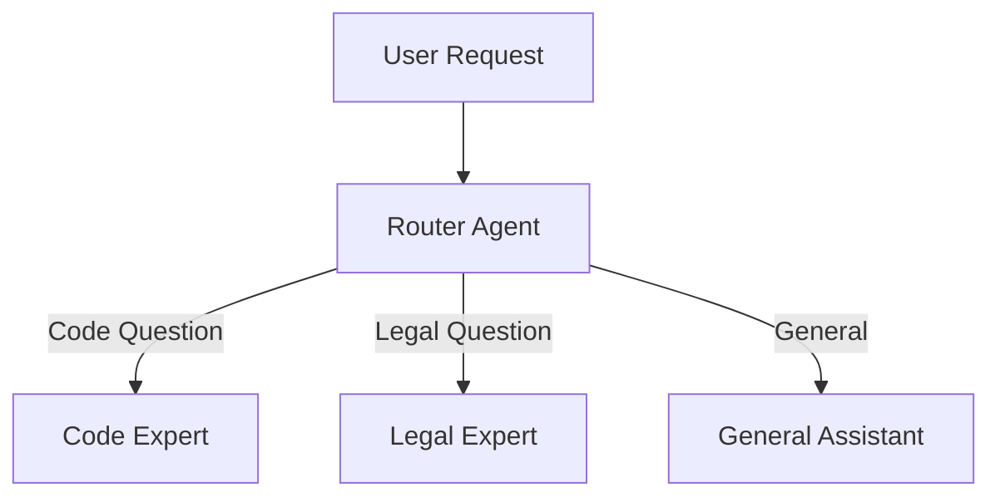
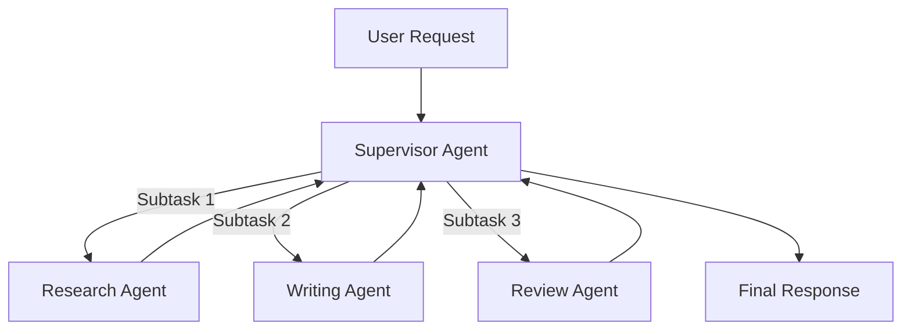
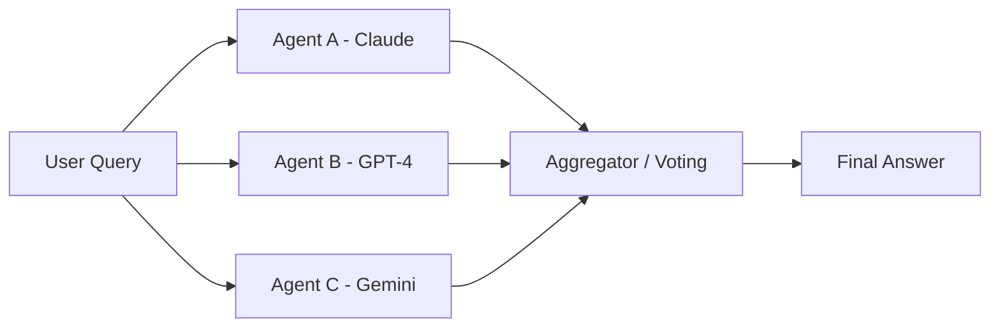

# Multi-Agent Architectures: Scaling AI Systems

While single-agent patterns like ReAct handle many tasks, complex problems often require **multiple specialized agents** working together. Multi-Agent Architectures define how to coordinate, route, and orchestrate teams of AI agents.

## Why Multi-Agent?

Single agents hit limits when:
- The task requires **multiple domains** of expertise (code + legal + design).
- Context windows overflow with too many tools/instructions.
- You need **parallel processing** of subtasks.
- **Quality control** requires separation between "doer" and "checker".

---

## 1. Router / Gatekeeper Pattern

The simplest multi-agent pattern. One agent classifies incoming requests and routes them to specialized sub-agents.

### How It Works



### Implementation

1. **Router Agent**: A lightweight classifier that analyzes the user's intent.
2. **Specialist Agents**: Each has a narrow focus with domain-specific prompts and tools.
3. **Response**: The selected specialist handles the request end-to-end.

### When to Use
- Customer support (billing vs. technical vs. sales)
- Enterprise assistants spanning multiple departments
- Multi-lingual routing

---

## 2. Supervisor / Orchestrator Pattern

A central "manager" agent that maintains control, delegates tasks, and synthesizes results. This is the pattern used by frameworks like **LangGraph**.

### How It Works



### The Supervisor's Role
1. **Decompose**: Break the user's goal into subtasks.
2. **Delegate**: Assign subtasks to specialized workers.
3. **Integrate**: Collect results and synthesize a final answer.
4. **Iterate**: Re-delegate if a worker's output is unsatisfactory.

### Key Advantage
The supervisor maintains **global context** of the overall goal, preventing workers from going off-track.

---

## 3. Hierarchical Teams (Manager-Worker)

For very large tasks, a single supervisor becomes a bottleneck. Hierarchical Teams introduce **layers of management**.

### Structure

```
CEO Agent (Top-Level Goal)
├── Engineering Manager
│   ├── Frontend Developer
│   └── Backend Developer
├── Design Manager
│   ├── UI Designer
│   └── UX Researcher
└── QA Manager
    └── Test Engineer
```

### How It Works
- Each "Manager" is itself a Supervisor agent with its own team.
- The CEO only talks to Managers, not individual workers.
- Managers translate high-level goals into specific technical tasks.

### When to Use
- Large-scale code generation projects
- Complex document creation (reports, proposals)
- Simulating organizational workflows

---

## 4. Consensus / Voting (Mixture of Agents)

Instead of a single agent deciding, **multiple agents reason independently**, and a final decision is made by voting or merging their outputs.

### Mixture of Agents (MoA)



### Aggregation Strategies

| Strategy | Description |
| :--- | :--- |
| **Majority Vote** | Pick the answer most agents agree on. |
| **Weighted Vote** | Some agents (e.g., domain experts) count more. |
| **LLM Aggregator** | A final LLM reads all answers and synthesizes the best one. |
| **Best-of-N** | Generate N responses, score them, pick the best. |

### When to Use
- High-stakes decisions requiring validation
- Reducing single-model biases
- Improving accuracy on complex reasoning tasks

---

## 5. Communication Patterns

How agents talk to each other matters.

### Direct (Point-to-Point)
Agents call each other directly. Simple but creates tight coupling.

### Blackboard
A shared memory space where agents post observations. Other agents read and react. Good for asynchronous collaboration.

### Message Queue
Agents publish/subscribe to topics. Decoupled and scalable, but more complex to implement.

---

## Comparison Table

| Pattern | Complexity | Control | Parallelism | Best For |
| :--- | :--- | :--- | :--- | :--- |
| **Router** | Low | Centralized | None | Classification / Routing |
| **Supervisor** | Medium | Centralized | Sequential | Multi-step workflows |
| **Hierarchical** | High | Distributed | Parallel subtrees | Large projects |
| **Consensus** | Medium | Distributed | Full parallel | High-accuracy tasks |

---

## Best Practices

1. **Start Simple**: Begin with Router or Supervisor. Add hierarchy only when needed.
2. **Limit Depth**: Keep hierarchies shallow (2-3 levels max) to reduce latency and cost.
3. **Clear Contracts**: Define exactly what each agent expects as input and output.
4. **Observability**: Log every agent call. Multi-agent debugging is hard without traces.
5. **Fallbacks**: If a specialist fails, the supervisor should be able to retry or escalate.

---

## Further Reading

- [LangGraph Documentation](https://python.langchain.com/docs/langgraph)
- [AutoGen by Microsoft](https://microsoft.github.io/autogen/)
- [CrewAI Framework](https://www.crewai.io/)

---
*This article extends the concepts from [Single-Agent Patterns](file:///Users/restuhaqza/Workspace/Personal/OpenSource/ai-guide/src/contents/single-agent-patterns.md).*
