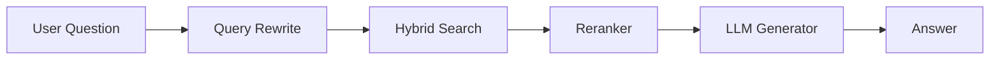

# RAG Architectures: From Naive to Advanced

Retrieval-Augmented Generation (RAG) is the architecture that connects LLMs to your private data. While the concept is simple—*find data, give to AI*—the implementation details determine whether your system hallucinates or succeeds.

## 1. Naive RAG (The Baseline)

The standard "Hello World" of RAG.
1.  **Retrieve:** Search Vector DB for top-k chunks.
2.  **Generate:** Stuff chunks into the prompt.

**Pros:** fast, cheap, easy to build.
**Cons:** Poor precision. if the user asks "What is the capital?", and the DB returns a document about "Financial Capital", the LLM will be confused.

## 2. Advanced RAG Patterns

To build production-grade systems, we need more control.

### Pre-Retrieval: Query Expansion
Users write bad queries. "My internet is slow" might need to search for "Latency," "Bandwidth," and "Router settings."
*   **Multi-Query:** Use an LLM to generate 3-5 variations of the user's question, search for all of them, and deduplicate results.
*   **HyDE (Hypothetical Document Embeddings):** Ask the LLM to *hallucinate* a perfect answer, embed that answer, and search for real documents that look like the hallucination.

### Retrieval: Hybrid Search
Vector search is great for concepts, but bad for specific keywords (like "Error 503" or "Product SKU-123").
*   **Hybrid Search:** Run a Keyword Search (BM25) AND a Vector Search (Cosine Similarity).
*   **Reciprocal Rank Fusion (RRF):** specific algorithm to merge the two lists into one best-of-both-worlds list.

### Post-Retrieval: Reranking
Vector search is fast but "fuzzy". It gives you the top 50 "maybe" relevant items.
*   **Reranker Model:** A specialized model (like Cohere Rerank or BGE-Reranker) that reads the question and the 50 docs and sorts them by *actual* relevance. It is slower but much more accurate.
*   **Context Compression:** removing irrelevant sentences from the retrieved chunks before sending them to the LLM to save tokens.

## 3. Chunking Strategies

How you slice your data defines what you can find.

| Strategy | Description | Best For |
| :--- | :--- | :--- |
| **Fixed-Size** | Split by every 500 characters. | Simple text, quick start. |
| **Recursive** | Split by paragraphs, then sentences. | Structured documents. |
| **Semantic** | Use embeddings to find break-points where the "topic" changes. | Complex, long-form essays. |
| **Agentic** | Let an LLM decide where to split. | High-accuracy requirements. |

## 4. Architecture Diagram (Mental Model)

## Conclusion

Start with Naive RAG to build the pipeline. Move to Advanced RAG (Hybrid Search + Reranking) when you hit quality ceilings. The quality of your retrieval usually matters more than the quality of your generator model.

---
*Reference: [RAG Techniques](https://github.com/langchain-ai/langchain)*
