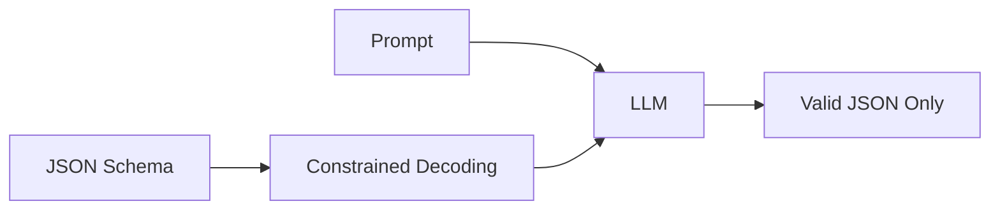

# Structured Outputs: Reliable JSON from LLMs

One of the biggest challenges in building LLM applications is getting **consistent, parseable outputs**. "Just return JSON" often fails. Structured Outputs solve this by enforcing schemas at generation time.

## Why Structured Outputs?

### The Problem

```python
response = llm.generate("Extract the user's name and age from: 'John is 25'")
# Sometimes: {"name": "John", "age": 25}
# Sometimes: {"name": "John", "age": "25"}  # age is string!
# Sometimes: Here's the extracted data: {"name": "John", "age": 25}
# Sometimes: ```json\n{"name": "John", "age": 25}\n```
```

### The Solution

Force the model to **only** output valid JSON matching your schema.

```python
from pydantic import BaseModel

class User(BaseModel):
    name: str
    age: int

response = llm.generate_structured(prompt, schema=User)
# Always: {"name": "John", "age": 25}
```

---

## How It Works



### Constrained Decoding
Instead of allowing the model to output any token, the system **restricts the vocabulary** at each step to only tokens that would produce valid JSON.

| Token Position | Allowed Tokens |
| :--- | :--- |
| Start | `{` only |
| After `{"name":` | `"` only (start of string) |
| After `{"name": "John", "age":` | digits only (integer field) |

This guarantees 100% schema compliance.

---

## 1. OpenAI Structured Outputs

OpenAI's native Structured Outputs feature (GPT-4o and later).

### Basic Usage

```python
from openai import OpenAI
from pydantic import BaseModel

client = OpenAI()

class CalendarEvent(BaseModel):
    name: str
    date: str
    participants: list[str]

response = client.beta.chat.completions.parse(
    model="gpt-4o",
    messages=[
        {"role": "system", "content": "Extract event details."},
        {"role": "user", "content": "Team lunch on Friday with Alice and Bob"}
    ],
    response_format=CalendarEvent
)

event = response.choices[0].message.parsed
# CalendarEvent(name="Team lunch", date="Friday", participants=["Alice", "Bob"])
```

### Features
- ✅ 100% schema compliance
- ✅ Native Pydantic support
- ✅ Supports nested objects, arrays, enums
- ❌ Slightly higher latency than free-form

---

## 2. Anthropic Tool Use (Claude)

Claude doesn't have native structured outputs, but **tool use** achieves the same result.

```python
import anthropic

client = anthropic.Anthropic()

tools = [{
    "name": "extract_user",
    "description": "Extract user information",
    "input_schema": {
        "type": "object",
        "properties": {
            "name": {"type": "string"},
            "age": {"type": "integer"}  
        },
        "required": ["name", "age"]
    }
}]

response = client.messages.create(
    model="claude-3-5-sonnet-20241022",
    max_tokens=1024,
    tools=tools,
    tool_choice={"type": "tool", "name": "extract_user"},
    messages=[
        {"role": "user", "content": "John is 25 years old"}
    ]
)

# response.content[0].input == {"name": "John", "age": 25}
```

---

## 3. Pydantic (Python)

The gold standard for defining schemas in Python.

### Basic Schema

```python
from pydantic import BaseModel, Field
from typing import Optional, Literal
from enum import Enum

class Priority(str, Enum):
    low = "low"
    medium = "medium"
    high = "high"

class Task(BaseModel):
    title: str = Field(description="Short task title")
    description: Optional[str] = Field(None, description="Detailed description")
    priority: Priority
    due_date: Optional[str] = Field(None, pattern=r"\d{4}-\d{2}-\d{2}")
```

### Generate JSON Schema

```python
schema = Task.model_json_schema()
# Pass this to the LLM
```

### Validate Response

```python
import json

response_text = '{"title": "Buy milk", "priority": "high"}'
task = Task.model_validate_json(response_text)
# Raises ValidationError if invalid
```

---

## 4. Zod (TypeScript/JavaScript)

The Pydantic equivalent for TypeScript.

### Define Schema

```typescript
import { z } from "zod";

const TaskSchema = z.object({
  title: z.string().describe("Short task title"),
  description: z.string().optional(),
  priority: z.enum(["low", "medium", "high"]),
  dueDate: z.string().regex(/\d{4}-\d{2}-\d{2}/).optional()
});

type Task = z.infer<typeof TaskSchema>;
```

### With OpenAI

```typescript
import OpenAI from "openai";
import { zodResponseFormat } from "openai/helpers/zod";

const client = new OpenAI();

const response = await client.beta.chat.completions.parse({
  model: "gpt-4o",
  messages: [{ role: "user", content: "Create a task: buy groceries" }],
  response_format: zodResponseFormat(TaskSchema, "task")
});

const task = response.choices[0].message.parsed;
```

---

## 5. Instructor Library

A wrapper library that adds structured outputs to any LLM.

### Installation

```bash
pip install instructor
```

### Usage

```python
import instructor
from openai import OpenAI
from pydantic import BaseModel

client = instructor.from_openai(OpenAI())

class User(BaseModel):
    name: str
    age: int

user = client.chat.completions.create(
    model="gpt-4",
    messages=[{"role": "user", "content": "John is 25"}],
    response_model=User
)
# User(name="John", age=25)
```

### Supports Multiple Providers

```python
# Anthropic
client = instructor.from_anthropic(Anthropic())

# Ollama (local models)
client = instructor.from_openai(
    OpenAI(base_url="http://localhost:11434/v1"),
    mode=instructor.Mode.JSON
)
```

---

## 6. Common Patterns

### Extraction

```python
class Invoice(BaseModel):
    vendor: str
    amount: float
    date: str
    items: list[str]

# "Extract invoice details from this PDF text: ..."
```

### Classification

```python
class SentimentResult(BaseModel):
    sentiment: Literal["positive", "negative", "neutral"]
    confidence: float = Field(ge=0, le=1)
    reasoning: str
```

### Function Arguments

```python
class SearchQuery(BaseModel):
    query: str
    filters: dict[str, str] = {}
    limit: int = Field(default=10, le=100)
```

### Chain-of-Thought + Answer

```python
class ReasonedAnswer(BaseModel):
    thinking: str = Field(description="Step-by-step reasoning")
    answer: str = Field(description="Final answer")
```

---

## 7. Best Practices

### 1. Always Use Descriptions

```python
# Bad
class User(BaseModel):
    name: str
    
# Good
class User(BaseModel):
    name: str = Field(description="User's full legal name")
```

### 2. Use Enums for Fixed Values

```python
# Bad
status: str  # Could be "active", "Active", "ACTIVE"...

# Good
status: Literal["active", "inactive", "pending"]
```

### 3. Set Reasonable Constraints

```python
class Product(BaseModel):
    price: float = Field(ge=0, description="Price in USD")
    quantity: int = Field(ge=1, le=1000)
```

### 4. Handle Optional Fields

```python
class Profile(BaseModel):
    name: str
    bio: Optional[str] = None  # Model can omit
    website: str = ""  # Model must include (can be empty)
```

### 5. Validate After Parsing

```python
try:
    result = Model.model_validate_json(response)
except ValidationError as e:
    # Retry with error feedback
    retry_prompt = f"Your response was invalid: {e}. Please try again."
```

---

## Comparison Table

| Feature | OpenAI | Anthropic | Instructor | JSON Mode |
| :--- | :--- | :--- | :--- | :--- |
| **100% Valid** | ✅ | ✅ (via tools) | ✅ | ❌ |
| **Schema Enforcement** | ✅ | ✅ | ✅ | ❌ |
| **Pydantic Native** | ✅ | ❌ | ✅ | ❌ |
| **Works Offline** | ❌ | ❌ | ✅ (w/ local) | ✅ |
| **Retry Logic** | ❌ | ❌ | ✅ | ❌ |

---

## Conclusion

Structured Outputs transform LLMs from "mostly works" to "always works" for data extraction and function calling. Start with your provider's native features (OpenAI's `response_format`, Claude's tools), and use Instructor for cross-provider compatibility.

---
*Related: [MCP & Tools](file:///Users/restuhaqza/Workspace/Personal/OpenSource/ai-guide/src/contents/mcp-and-tools.md) and [Prompt Engineering Standards](file:///Users/restuhaqza/Workspace/Personal/OpenSource/ai-guide/src/contents/prompt-engineering-standards.md).*
