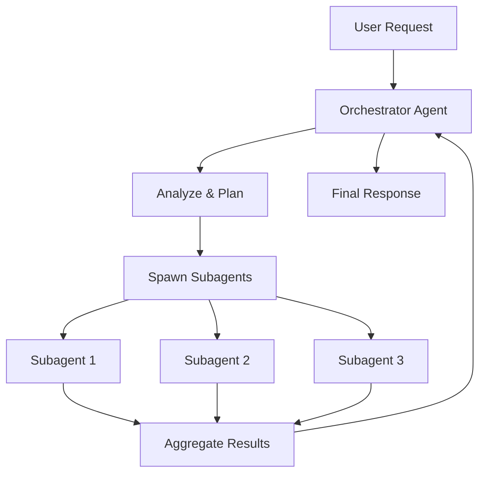
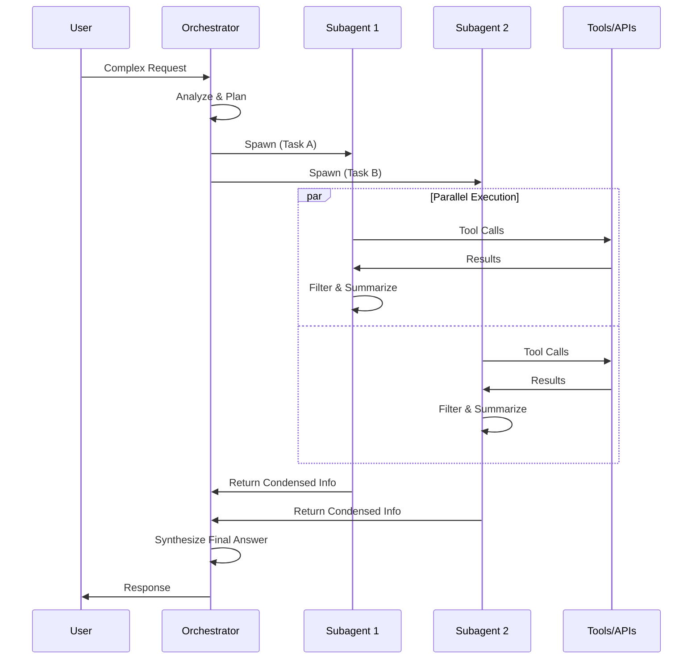
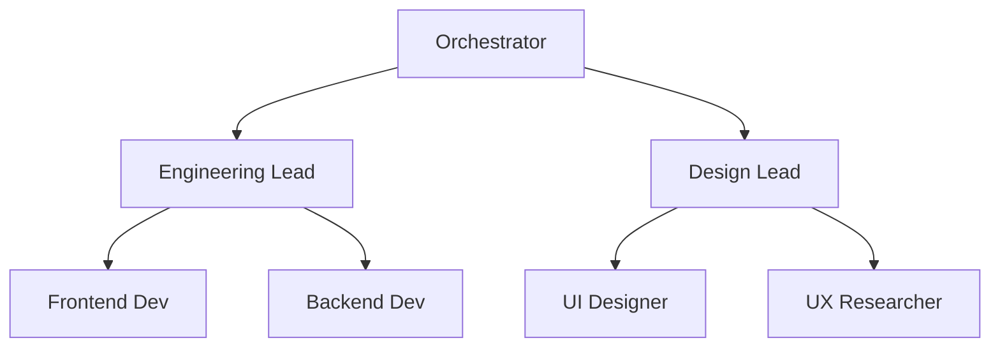
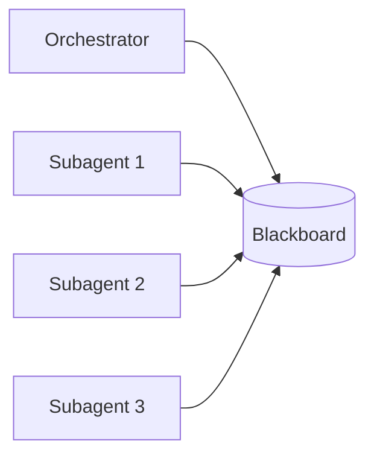
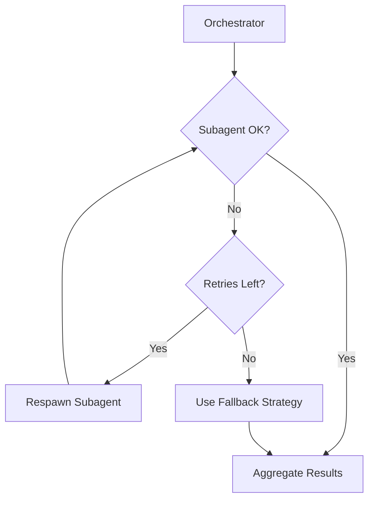

# Subagent & Agent Orchestrator: Advanced Multi-Agent Coordination

As AI systems tackle increasingly complex tasks, the **Subagent** and **Agent Orchestrator** patterns have emerged as critical architectural components. These patterns enable sophisticated coordination, parallel processing, and intelligent task delegation that goes beyond simple multi-agent setups.

## What is an Agent Orchestrator?

An **Agent Orchestrator** (also called Lead Agent or Supervisor) is a specialized AI agent responsible for:

- **Strategic Planning**: Analyzing user requests and developing execution strategies
- **Task Decomposition**: Breaking complex problems into manageable subtasks  
- **Agent Spawning**: Creating and managing specialized subagents
- **Result Aggregation**: Collecting and synthesizing outputs from subagents
- **Quality Control**: Validating results and triggering retries if needed



---

## What are Subagents?

**Subagents** are specialized worker agents spawned by an orchestrator to handle specific aspects of a larger task. Key characteristics:

### 1. Focused Expertise
Each subagent has a narrow, well-defined responsibility:
- Research Subagent → Gather information from tools/APIs
- Analysis Subagent → Process and interpret data
- Writing Subagent → Generate formatted outputs
- Validation Subagent → Check results for accuracy

### 2. Parallel Execution
Subagents operate **concurrently**, dramatically reducing total execution time compared to sequential processing.

### 3. Information Filtering
Subagents act as **intelligent filters**—they gather extensive information using tools, then condense it to only the most relevant tokens before returning to the orchestrator.

### 4. Autonomous Operation
Once spawned, subagents work independently within their defined scope, making tool calls and decisions without constant orchestrator oversight.

---

## The Orchestrator-Worker Pattern

This is the most widely adopted pattern in production AI systems, used by frameworks like **Anthropic Claude**, **LangGraph**, and **CrewAI**.

### How It Works



### Implementation Stages

#### Stage 1: Task Analysis
The orchestrator receives the user request and determines:
- What subtasks are needed?
- Which specialized agents to spawn?
- What are the dependencies between tasks?
- Can any tasks run in parallel?

#### Stage 2: Subagent Spawning
For each identified subtask, the orchestrator:
1. Creates a subagent with a focused prompt
2. Provides relevant context and constraints
3. Specifies expected output format
4. Defines success criteria

#### Stage 3: Parallel Execution
Subagents work independently:
- Each makes its own tool calls
- Follows its specialized reasoning process
- Filters results to extract key information
- Returns condensed, relevant tokens to orchestrator

#### Stage 4: Result Synthesis
The orchestrator:
- Collects all subagent outputs
- Identifies conflicts or gaps
- Synthesizes a coherent final answer
- May spawn additional subagents if needed

---

## Subagent Spawn Patterns

### 1. Static Spawn
Predefined subagents for known task types:

```python
# Pseudocode
def handle_code_review(request):
    subagents = [
        spawn("security_reviewer", focus="vulnerabilities"),
        spawn("style_checker", focus="code conventions"),
        spawn("performance_analyzer", focus="efficiency")
    ]
    return orchestrate(subagents, request)
```

### 2. Dynamic Spawn
Orchestrator decides at runtime which subagents to create:

```python
# Pseudocode
def dynamic_orchestrate(request):
    analysis = analyze_request(request)
    
    subagents = []
    if analysis.needs_research:
        subagents.append(spawn("researcher"))
    if analysis.needs_code:
        subagents.append(spawn("coder"))
    if analysis.needs_validation:
        subagents.append(spawn("validator"))
    
    return orchestrate(subagents, request)
```

### 3. Recursive Spawn
Subagents can spawn their own subagents for complex subtasks:



---

## Communication Patterns

### Direct Return
Subagents return results directly to the spawning orchestrator.

**Pros**: Simple, low latency  
**Cons**: All communication flows through one point

### Shared Memory (Blackboard)
All agents read/write to a shared state store.



**Pros**: Subagents can see each other's work  
**Cons**: Requires synchronization, potential conflicts

### Event-Driven
Agents emit events that others subscribe to.

**Pros**: Decoupled, scalable  
**Cons**: More complex to implement and debug

---

## Token Efficiency Strategies

A critical challenge in orchestrator-subagent systems is **token management**. Subagents must balance thoroughness with efficiency.

### 1. Summarization Protocol
Subagents summarize findings before returning:

```
# Bad: Return raw data (10,000 tokens)
{full_api_response}

# Good: Return summary (200 tokens)
"Found 3 critical vulnerabilities in auth.py:
1. SQL injection on line 45
2. Missing input validation line 89
3. Hardcoded credentials line 12"
```

### 2. Relevance Filtering
Only return information directly relevant to the original task.

### 3. Progressive Detail
Start with high-level summary, provide details only if orchestrator requests them.

---

## Error Handling & Recovery

### Subagent Failure Modes

| Failure | Orchestrator Response |
|:--------|:---------------------|
| Timeout | Retry with longer limit or spawn replacement |
| Bad Output | Provide feedback and re-run |
| Tool Error | Route to alternative tool or escalate |
| Deadlock | Kill and redistribute task |

### Retry Strategies



---

## Real-World Examples

### 1. Claude's Research Mode
When Claude handles a complex research question:
1. **Orchestrator** analyzes the query
2. Spawns **multiple search subagents** for different aspects
3. Each subagent explores a facet of the topic in parallel
4. Orchestrator synthesizes findings into coherent answer

### 2. Cursor/Windsurf Code Agents
When an AI coding assistant processes a feature request:
1. **Orchestrator** understands the feature scope
2. Spawns **file discovery subagent** to find relevant files
3. Spawns **implementation subagent** for each file
4. Spawns **test subagent** to generate tests
5. Orchestrator coordinates merging all changes

### 3. AutoGen Multi-Agent Systems
Microsoft's AutoGen framework:
- **UserProxy** acts as orchestrator
- Multiple **AssistantAgents** as specialized subagents
- Conversation-based coordination between agents

---

## Best Practices

### 1. Clear Boundaries
Define explicit input/output contracts for each subagent role.

### 2. Limit Depth
Keep hierarchies shallow (2-3 levels max). Deeper = slower + more costly.

### 3. Fail Fast
Subagents should quickly identify when they can't complete a task and return control.

### 4. Observability
Log every subagent spawn, tool call, and return value. Multi-agent debugging requires full traces.

### 5. Cost Awareness
Track token usage per subagent. Some tasks don't justify parallel execution overhead.

### 6. Human-in-the-Loop
For high-stakes decisions, orchestrators should escalate to human review rather than auto-delegating to subagents.

---

## Comparison: Orchestrator vs Other Patterns

| Aspect | Router | Orchestrator | Peer-to-Peer |
|:-------|:-------|:-------------|:-------------|
| **Control** | Centralized | Centralized | Distributed |
| **Parallelism** | None | High | Variable |
| **Complexity** | Low | Medium-High | High |
| **Token Cost** | Low | Higher | Variable |
| **Best For** | Simple routing | Complex workflows | Resilient systems |

---

## When to Use Orchestrator-Subagent

✅ **Use When:**
- Tasks have natural parallel decomposition
- Multiple specialized skills needed
- Results need synthesis from multiple sources
- Time-to-response matters

❌ **Avoid When:**
- Simple tasks that don't need decomposition
- Token budget is very limited
- Debugging infrastructure isn't in place
- Tasks are highly sequential with tight dependencies

---

## Tools & Frameworks

| Framework | Orchestration Style | Key Feature |
|:----------|:-------------------|:------------|
| **LangGraph** | Graph-based workflows | Visual state machines |
| **CrewAI** | Role-based crews | Agent personas |
| **AutoGen** | Conversation-based | Multi-turn agent chat |
| **Google ADK** | Hierarchical | Google ecosystem integration |
| **Semantic Kernel** | Plugin-based | .NET and enterprise focus |
| **OpenAI Agents SDK** | Function-based | GPT integration |

---

## Further Reading

- [Anthropic's Agent Patterns](https://docs.anthropic.com/en/docs/build-with-claude/agentic-patterns)
- [LangGraph Multi-Agent](https://python.langchain.com/docs/langgraph)
- [Microsoft AutoGen](https://microsoft.github.io/autogen/)
- [CrewAI Documentation](https://docs.crewai.com/)
- [Google Agent Development Kit](https://developers.google.com/agent-development-kit)

---

*This article extends concepts from [Multi-Agent Architectures](file:///Users/restuhaqza/Workspace/Personal/OpenSource/ai-guide/src/contents/multi-agent-architectures.md) and connects to [Single-Agent Patterns](file:///Users/restuhaqza/Workspace/Personal/OpenSource/ai-guide/src/contents/single-agent-patterns.md).*
