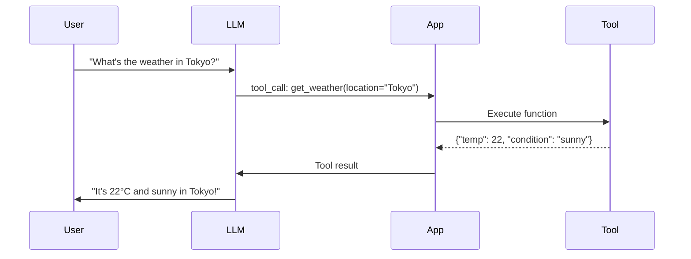

# Tool Use & Function Calling

Tool use (also called "function calling") is how LLMs interact with the outside world. Instead of just generating text, the model outputs structured commands that your application can execute.

## Why Tool Use?

LLMs are powerful reasoners but have limitations:
- ❌ Can't access real-time data
- ❌ Can't perform calculations reliably
- ❌ Can't interact with external systems

Tools bridge this gap by letting the model **request actions**.



---

## The Tool Definition Schema

All providers use a JSON Schema-based format to define tools.

### OpenAI Format

```json
{
  "type": "function",
  "function": {
    "name": "get_weather",
    "description": "Get current weather for a location",
    "parameters": {
      "type": "object",
      "properties": {
        "location": {
          "type": "string",
          "description": "City name, e.g., 'Tokyo' or 'San Francisco, CA'"
        },
        "unit": {
          "type": "string",
          "enum": ["celsius", "fahrenheit"],
          "description": "Temperature unit"
        }
      },
      "required": ["location"]
    }
  }
}
```

### Anthropic Format

```json
{
  "name": "get_weather",
  "description": "Get current weather for a location",
  "input_schema": {
    "type": "object",
    "properties": {
      "location": {
        "type": "string",
        "description": "City name"
      }
    },
    "required": ["location"]
  }
}
```

---

## Implementation Examples

### OpenAI (Python)

```python
from openai import OpenAI

client = OpenAI()

tools = [{
    "type": "function",
    "function": {
        "name": "search_database",
        "description": "Search the product database",
        "parameters": {
            "type": "object",
            "properties": {
                "query": {"type": "string"},
                "limit": {"type": "integer", "default": 10}
            },
            "required": ["query"]
        }
    }
}]

response = client.chat.completions.create(
    model="gpt-4o",
    messages=[{"role": "user", "content": "Find laptops under $1000"}],
    tools=tools,
    tool_choice="auto"
)

# Check if model wants to use a tool
if response.choices[0].message.tool_calls:
    tool_call = response.choices[0].message.tool_calls[0]
    print(f"Function: {tool_call.function.name}")
    print(f"Arguments: {tool_call.function.arguments}")
```

### Anthropic (Python)

```python
import anthropic

client = anthropic.Anthropic()

tools = [{
    "name": "calculate",
    "description": "Perform mathematical calculations",
    "input_schema": {
        "type": "object",
        "properties": {
            "expression": {
                "type": "string",
                "description": "Math expression like '2 + 2' or 'sqrt(16)'"
            }
        },
        "required": ["expression"]
    }
}]

response = client.messages.create(
    model="claude-3-5-sonnet-20241022",
    max_tokens=1024,
    tools=tools,
    messages=[{"role": "user", "content": "What's 15% of 847?"}]
)

# Check for tool use
for block in response.content:
    if block.type == "tool_use":
        print(f"Tool: {block.name}")
        print(f"Input: {block.input}")
```

---

## The Tool Loop Pattern

Most applications need to **execute** the tool and feed results back.

```python
import json

def run_tool_loop(user_message: str, tools: list, max_iterations: int = 5):
    messages = [{"role": "user", "content": user_message}]
    
    for _ in range(max_iterations):
        response = client.chat.completions.create(
            model="gpt-4o",
            messages=messages,
            tools=tools
        )
        
        assistant_message = response.choices[0].message
        messages.append(assistant_message)
        
        # No tool calls = done
        if not assistant_message.tool_calls:
            return assistant_message.content
        
        # Execute each tool call
        for tool_call in assistant_message.tool_calls:
            result = execute_tool(
                tool_call.function.name,
                json.loads(tool_call.function.arguments)
            )
            messages.append({
                "role": "tool",
                "tool_call_id": tool_call.id,
                "content": json.dumps(result)
            })
    
    return "Max iterations reached"

def execute_tool(name: str, args: dict) -> dict:
    """Your tool implementations here"""
    if name == "get_weather":
        return {"temp": 22, "condition": "sunny"}
    elif name == "search_database":
        return {"results": ["Product A", "Product B"]}
    return {"error": f"Unknown tool: {name}"}
```

---

## Common Tool Patterns

### 1. Information Retrieval

```python
tools = [
    {
        "name": "search_web",
        "description": "Search the internet for current information",
        "input_schema": {
            "type": "object",
            "properties": {
                "query": {"type": "string"}
            },
            "required": ["query"]
        }
    },
    {
        "name": "search_knowledge_base",
        "description": "Search internal documentation",
        "input_schema": {
            "type": "object",
            "properties": {
                "query": {"type": "string"},
                "collection": {"type": "string", "enum": ["docs", "faq", "policies"]}
            },
            "required": ["query"]
        }
    }
]
```

### 2. Actions / Side Effects

```python
{
    "name": "send_email",
    "description": "Send an email to a recipient",
    "input_schema": {
        "type": "object",
        "properties": {
            "to": {"type": "string", "format": "email"},
            "subject": {"type": "string"},
            "body": {"type": "string"}
        },
        "required": ["to", "subject", "body"]
    }
}
```

### 3. Multi-step Workflows

```python
{
    "name": "create_order",
    "description": "Create a new customer order",
    "input_schema": {
        "type": "object",
        "properties": {
            "customer_id": {"type": "string"},
            "items": {
                "type": "array",
                "items": {
                    "type": "object",
                    "properties": {
                        "product_id": {"type": "string"},
                        "quantity": {"type": "integer"}
                    }
                }
            },
            "shipping_address": {"type": "string"}
        },
        "required": ["customer_id", "items"]
    }
}
```

---

## Tool Choice Options

Control when and which tools the model uses:

| Option | Behavior |
| :--- | :--- |
| `"auto"` | Model decides whether to use tools |
| `"none"` | Model won't use any tools |
| `"required"` | Model must use a tool |
| `{"name": "specific_tool"}` | Model must use this specific tool |

```python
# Force a specific tool
response = client.chat.completions.create(
    model="gpt-4o",
    messages=messages,
    tools=tools,
    tool_choice={"type": "function", "function": {"name": "search_database"}}
)
```

---

## Best Practices

### 1. Write Clear Descriptions

```python
# ❌ Bad
{"name": "search", "description": "Search stuff"}

# ✅ Good
{
    "name": "search_products",
    "description": "Search the e-commerce product catalog. Use when users ask about products, prices, or availability. Returns product name, price, and stock status."
}
```

### 2. Validate Tool Outputs

```python
from pydantic import BaseModel, ValidationError

class WeatherResult(BaseModel):
    temp: float
    condition: str
    humidity: int

def execute_weather_tool(args: dict) -> dict:
    raw_result = call_weather_api(args["location"])
    try:
        validated = WeatherResult(**raw_result)
        return validated.model_dump()
    except ValidationError as e:
        return {"error": str(e)}
```

### 3. Handle Errors Gracefully

```python
def execute_tool(name: str, args: dict) -> dict:
    try:
        result = tool_registry[name](**args)
        return {"success": True, "data": result}
    except KeyError:
        return {"success": False, "error": f"Unknown tool: {name}"}
    except Exception as e:
        return {"success": False, "error": str(e)}
```

### 4. Use Parallel Tool Calls

Both OpenAI and Anthropic support calling multiple tools in parallel:

```python
# Model might return multiple tool_calls
for tool_call in response.choices[0].message.tool_calls:
    # Execute each one
    results.append(execute_tool(tool_call.function.name, ...))
```

---

## Security Considerations

> [!CAUTION]
> Never let the LLM execute arbitrary code or make privileged API calls without validation.

### Safeguards

1. **Allowlist tools**: Only expose necessary functions
2. **Validate inputs**: Don't trust LLM-generated arguments blindly
3. **Rate limit**: Prevent runaway tool loops
4. **Audit logging**: Record all tool executions
5. **Confirmation for destructive actions**: Require user approval for send_email, delete_file, etc.

---

## Comparison: OpenAI vs Anthropic

| Feature | OpenAI | Anthropic |
| :--- | :--- | :--- |
| Schema key | `parameters` | `input_schema` |
| Tool choice | `tool_choice` | `tool_choice` |
| Parallel calls | ✅ Yes | ✅ Yes |
| Streaming support | ✅ Yes | ✅ Yes |
| Nested objects | ✅ Yes | ✅ Yes |

---

## Conclusion

Tool use transforms LLMs from text generators into intelligent agents that can take action. Start with simple read-only tools (search, lookup), then gradually add write operations with proper safeguards.

---
*Related: [MCP & Tools](./mcp-and-tools) | [Structured Outputs](./structured-outputs) | [Single-Agent Patterns](./single-agent-patterns)*
