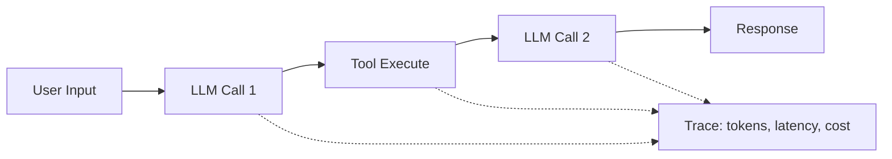
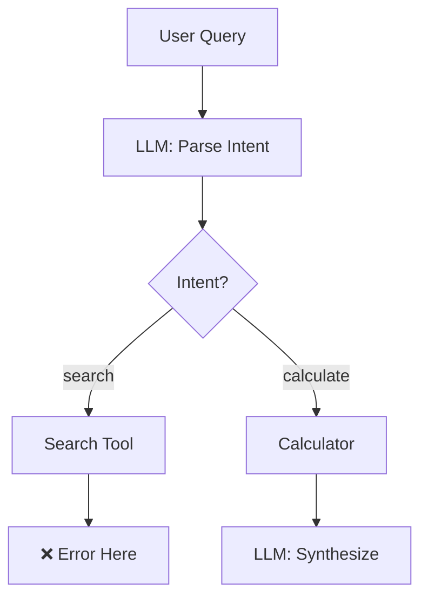

# Tracing & Observability for LLM Applications

When LLM applications fail, they fail silently. A chain that worked yesterday might start hallucinating today. Observability tools help you understand **what happened**, **why it failed**, and **how much it cost**.

## Why Observability?

### Traditional Software vs. LLM Apps

| Traditional | LLM Applications |
| :--- | :--- |
| Deterministic | Non-deterministic |
| Fast failures | Silent degradation |
| Error messages | Hallucinations |
| Fixed costs | Variable token costs |

### What You Need to Track



Key metrics:
- **Latency**: Time per step and total
- **Tokens**: Input/output token counts
- **Cost**: $ per request
- **Quality**: User feedback, error rates
- **Traces**: Full conversation flow

---

## Observability Tools

### 1. Langfuse (Open Source)

Self-hostable, open-source observability platform.

```python
from langfuse import Langfuse
from langfuse.decorators import observe

langfuse = Langfuse()

@observe()
def my_llm_function(user_input: str):
    # Automatically traced
    response = openai.chat.completions.create(
        model="gpt-4o",
        messages=[{"role": "user", "content": user_input}]
    )
    return response.choices[0].message.content

# Or manually
with langfuse.trace(name="chat-completion") as trace:
    generation = trace.generation(
        name="gpt-4o-call",
        model="gpt-4o",
        input=messages,
    )
    response = openai.chat.completions.create(...)
    generation.end(output=response)
```

**Features**:
- ✅ Open source (self-host or cloud)
- ✅ Prompt management
- ✅ A/B testing
- ✅ User feedback collection

---

### 2. LangSmith (LangChain)

First-party observability for LangChain.

```python
import os
os.environ["LANGCHAIN_TRACING_V2"] = "true"
os.environ["LANGCHAIN_API_KEY"] = "..."

from langchain_openai import ChatOpenAI
from langchain_core.prompts import ChatPromptTemplate

# Automatic tracing enabled
llm = ChatOpenAI(model="gpt-4o")
chain = prompt | llm

# All calls are automatically traced
result = chain.invoke({"input": "Hello"})
```

**Features**:
- ✅ Native LangChain integration
- ✅ Playground for testing
- ✅ Dataset management
- ✅ Evaluation runs

---

### 3. Phoenix (Arize)

Open-source tool focused on embeddings and RAG.

```python
import phoenix as px

# Launch local UI
session = px.launch_app()

# Trace RAG pipeline
from phoenix.trace.openai import OpenAIInstrumentor
OpenAIInstrumentor().instrument()

# All OpenAI calls now traced
response = openai.chat.completions.create(...)

# View at http://localhost:6006
```

**Best for**: RAG debugging, embedding analysis

---

### 4. OpenLLMetry (OpenTelemetry)

Vendor-agnostic tracing using OpenTelemetry.

```python
from opentelemetry import trace
from opentelemetry.sdk.trace import TracerProvider
from traceloop.sdk import Traceloop

Traceloop.init()

# Now all LLM calls are traced to your OTLP endpoint
```

**Features**:
- ✅ Works with Datadog, Honeycomb, Jaeger
- ✅ Vendor neutral
- ✅ Production-grade

---

## What to Trace

### 1. Token Usage

```python
@observe()
def track_usage(prompt: str):
    response = client.chat.completions.create(
        model="gpt-4o",
        messages=[{"role": "user", "content": prompt}]
    )
    
    # Log token usage
    usage = response.usage
    langfuse.score(
        trace_id=langfuse.get_trace_id(),
        name="tokens",
        value=usage.total_tokens
    )
    
    return response
```

### 2. Latency Breakdown

```python
import time

with langfuse.trace(name="rag-pipeline") as trace:
    # Embedding step
    start = time.time()
    embeddings = embed(query)
    trace.span(name="embedding", duration_ms=(time.time()-start)*1000)
    
    # Retrieval step
    start = time.time()
    docs = vector_db.search(embeddings)
    trace.span(name="retrieval", duration_ms=(time.time()-start)*1000)
    
    # Generation step
    start = time.time()
    response = llm.generate(query, docs)
    trace.span(name="generation", duration_ms=(time.time()-start)*1000)
```

### 3. Cost Calculation

```python
PRICING = {
    "gpt-4o": {"input": 0.005, "output": 0.015},  # per 1K tokens
    "gpt-4o-mini": {"input": 0.00015, "output": 0.0006},
    "claude-3-5-sonnet": {"input": 0.003, "output": 0.015}
}

def calculate_cost(model: str, input_tokens: int, output_tokens: int) -> float:
    prices = PRICING[model]
    return (input_tokens * prices["input"] + 
            output_tokens * prices["output"]) / 1000
```

---

## Debugging Patterns

### 1. Failed Chains



Traces show exactly where the chain broke.

### 2. Hallucination Detection

```python
def detect_hallucination(query: str, response: str, sources: list):
    """Compare response claims against source documents"""
    check_prompt = f"""
    Query: {query}
    Response: {response}
    Sources: {sources}
    
    List any claims in the response not supported by sources.
    """
    
    result = llm.generate(check_prompt)
    
    # Log as evaluation
    langfuse.score(
        name="hallucination_check",
        value=1 if "no unsupported claims" in result.lower() else 0
    )
```

### 3. Quality Regression

Set up automated evals that run nightly:

```python
def nightly_eval():
    test_cases = load_test_set()
    
    for case in test_cases:
        result = chain.invoke(case["input"])
        score = evaluate(result, case["expected"])
        
        langfuse.score(
            name="nightly_accuracy",
            value=score,
            metadata={"test_id": case["id"]}
        )
```

---

## Dashboards & Alerts

### Key Metrics to Monitor

| Metric | Alert Threshold |
| :--- | :--- |
| P95 Latency | > 5 seconds |
| Error Rate | > 5% |
| Daily Cost | > $X budget |
| Token/request | > 4000 (context limit risk) |

### Example Grafana Query

```sql
SELECT 
    date_trunc('hour', timestamp) as time,
    avg(latency_ms) as avg_latency,
    sum(cost_usd) as total_cost,
    count(*) as requests
FROM traces
WHERE timestamp > now() - interval '24 hours'
GROUP BY 1
ORDER BY 1
```

---

## Best Practices

### 1. Trace IDs for Debugging

```python
# Include trace ID in responses for customer support
response = {
    "answer": result,
    "trace_id": langfuse.get_trace_id()  # "abc123"
}

# Support can look up: langfuse.com/traces/abc123
```

### 2. Structured Metadata

```python
langfuse.trace(
    name="chat",
    user_id="user_123",
    session_id="session_abc",
    metadata={
        "model": "gpt-4o",
        "feature_flag": "new_prompt_v2",
        "environment": "production"
    }
)
```

### 3. Privacy Considerations

```python
# Redact PII before logging
import re

def redact_pii(text: str) -> str:
    text = re.sub(r'\b[\w.-]+@[\w.-]+\.\w+\b', '[EMAIL]', text)
    text = re.sub(r'\b\d{3}-\d{2}-\d{4}\b', '[SSN]', text)
    return text

langfuse.generation(
    input=redact_pii(user_input),
    output=redact_pii(response)
)
```

---

## Tool Comparison

| Feature | Langfuse | LangSmith | Phoenix |
| :--- | :--- | :--- | :--- |
| Open Source | ✅ | ❌ | ✅ |
| Self-host | ✅ | ❌ | ✅ |
| LangChain native | ✅ | ✅ | ✅ |
| Prompt versioning | ✅ | ✅ | ❌ |
| Cost tracking | ✅ | ✅ | ❌ |
| RAG debugging | ⚠️ | ⚠️ | ✅ |

---

## Conclusion

Observability transforms LLM development from guesswork to data-driven iteration. Start with basic tracing (latency, tokens, cost), then add quality evaluation as your application matures.

---
*Related: [Evaluation Guide](./evaluation-guide) | [RAG Architectures](./rag-architectures)*
