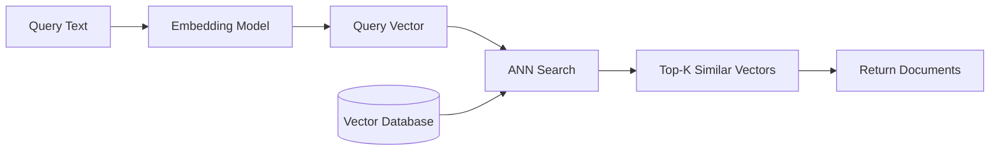
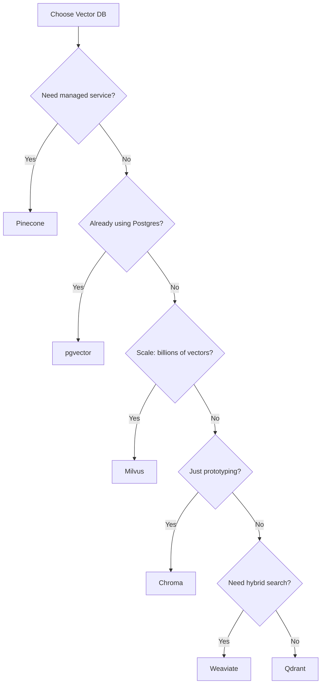

# Vector Databases: The Complete Guide

Vector databases are purpose-built to store, index, and query high-dimensional vectors (embeddings). They are the backbone of modern AI applications like semantic search, recommendation systems, and RAG (Retrieval-Augmented Generation).

## Why Vector Databases?

Traditional databases are optimized for exact matches:
```sql
SELECT * FROM users WHERE email = 'alice@example.com'
```

But AI needs **similarity search**:
> "Find documents that are *conceptually similar* to this query"

Vector databases solve this by using specialized algorithms (ANN - Approximate Nearest Neighbor) to find similar vectors in milliseconds, even among billions of records.

---

## How Vector Search Works



### Key Concepts

| Concept | Description |
| :--- | :--- |
| **Embedding** | A vector (list of floats) representing semantic meaning |
| **Dimension** | Length of the vector (e.g., 768, 1536, 3072) |
| **Distance Metric** | How similarity is measured (Cosine, Euclidean, Dot Product) |
| **Index** | Data structure for fast search (HNSW, IVF, etc.) |
| **ANN** | Approximate Nearest Neighbor - fast but not 100% exact |

---

## Popular Vector Databases Compared

### Quick Comparison

| Database | Type | Best For | Pricing Model |
| :--- | :--- | :--- | :--- |
| **Pinecone** | Managed Cloud | Production, Zero-ops | Pay-per-use |
| **Weaviate** | Open Source + Cloud | GraphQL fans, Hybrid search | Free (self-host) / Cloud |
| **Milvus** | Open Source | Large scale, On-prem | Free |
| **Chroma** | Open Source | Prototyping, Local dev | Free |
| **Qdrant** | Open Source + Cloud | Rust performance, Filtering | Free / Cloud |
| **pgvector** | PostgreSQL Extension | Existing Postgres users | Free |

---

## 1. Pinecone

The most popular **fully-managed** vector database. Zero infrastructure to manage.

### Pros
- ✅ Serverless option (pay only for what you use)
- ✅ Extremely easy to set up
- ✅ Built-in replication and high availability
- ✅ Excellent documentation

### Cons
- ❌ Vendor lock-in (no self-hosting)
- ❌ Can get expensive at scale
- ❌ Limited filtering capabilities compared to others

### Code Example
```python
import pinecone

pinecone.init(api_key="YOUR_KEY", environment="us-west1-gcp")
index = pinecone.Index("my-index")

# Upsert vectors
index.upsert([
    ("id1", [0.1, 0.2, 0.3, ...], {"source": "doc1.pdf"}),
    ("id2", [0.4, 0.5, 0.6, ...], {"source": "doc2.pdf"})
])

# Query
results = index.query(vector=[0.1, 0.2, ...], top_k=10)
```

---

## 2. Weaviate

An open-source vector database with **GraphQL API** and built-in vectorization.

### Pros
- ✅ Built-in embedding models (no separate embedding service needed)
- ✅ Hybrid search (vector + keyword BM25)
- ✅ GraphQL-native queries
- ✅ Multi-tenancy support

### Cons
- ❌ Higher learning curve
- ❌ Resource-heavy for small deployments

### Code Example
```python
import weaviate

client = weaviate.Client("http://localhost:8080")

# Create schema
client.schema.create_class({
    "class": "Document",
    "vectorizer": "text2vec-openai"
})

# Add objects (auto-vectorized)
client.data_object.create({
    "content": "The capital of France is Paris."
}, class_name="Document")

# Semantic search
result = client.query.get("Document", ["content"]) \
    .with_near_text({"concepts": ["French cities"]}) \
    .with_limit(5) \
    .do()
```

---

## 3. Milvus

An open-source vector database designed for **massive scale** (billions of vectors).

### Pros
- ✅ Proven at scale (used by major enterprises)
- ✅ Multiple index types (IVF, HNSW, DiskANN)
- ✅ Kubernetes-native deployment
- ✅ GPU acceleration support

### Cons
- ❌ Complex to deploy and operate
- ❌ Steeper learning curve

### Code Example
```python
from pymilvus import connections, Collection, FieldSchema, CollectionSchema, DataType

connections.connect("default", host="localhost", port="19530")

# Define schema
fields = [
    FieldSchema(name="id", dtype=DataType.INT64, is_primary=True),
    FieldSchema(name="embedding", dtype=DataType.FLOAT_VECTOR, dim=768)
]
schema = CollectionSchema(fields)
collection = Collection("documents", schema)

# Insert
collection.insert([[1, 2, 3], [[0.1]*768, [0.2]*768, [0.3]*768]])

# Search
results = collection.search(
    data=[[0.1]*768],
    anns_field="embedding",
    param={"metric_type": "COSINE", "params": {"ef": 64}},
    limit=10
)
```

---

## 4. Chroma

The **simplest** vector database, perfect for prototyping and local development.

### Pros
- ✅ Incredibly easy to start (pip install chromadb)
- ✅ No server needed (embedded mode)
- ✅ Great for Jupyter notebooks
- ✅ First-class LangChain integration

### Cons
- ❌ Not designed for production scale
- ❌ Limited advanced features

### Code Example
```python
import chromadb

client = chromadb.Client()
collection = client.create_collection("my_docs")

# Add documents (auto-embedded)
collection.add(
    documents=["Paris is the capital of France", "Tokyo is in Japan"],
    ids=["doc1", "doc2"]
)

# Query
results = collection.query(
    query_texts=["What is the capital of France?"],
    n_results=2
)
```

---

## 5. Qdrant (Recommended)

Written in **Rust** for performance. Great balance of features and simplicity.

### Pros
- ✅ High performance (Rust-based)
- ✅ Rich filtering capabilities
- ✅ Easy to deploy (Docker, Cloud)
- ✅ Excellent payload (metadata) handling

### Cons
- ❌ Smaller community than Pinecone/Weaviate

### Code Example
```python
from qdrant_client import QdrantClient
from qdrant_client.models import VectorParams, Distance

client = QdrantClient("localhost", port=6333)

# Create collection
client.create_collection(
    collection_name="documents",
    vectors_config=VectorParams(size=768, distance=Distance.COSINE)
)

# Upsert
client.upsert(
    collection_name="documents",
    points=[
        {"id": 1, "vector": [0.1]*768, "payload": {"source": "doc1.pdf"}},
        {"id": 2, "vector": [0.2]*768, "payload": {"source": "doc2.pdf"}}
    ]
)

# Search with filter
results = client.search(
    collection_name="documents",
    query_vector=[0.1]*768,
    query_filter={"must": [{"key": "source", "match": {"value": "doc1.pdf"}}]},
    limit=10
)
```

---

## 6. pgvector

A **PostgreSQL extension** that adds vector similarity search. Use your existing Postgres!

### Pros
- ✅ No new database to manage
- ✅ Full SQL power (JOINs, transactions)
- ✅ ACID compliance
- ✅ Free and open source

### Cons
- ❌ Slower than purpose-built vector DBs at scale
- ❌ Limited index options

### Code Example
```sql
-- Enable extension
CREATE EXTENSION vector;

-- Create table with vector column
CREATE TABLE documents (
    id SERIAL PRIMARY KEY,
    content TEXT,
    embedding VECTOR(768)
);

-- Create index
CREATE INDEX ON documents USING ivfflat (embedding vector_cosine_ops);

-- Query
SELECT * FROM documents
ORDER BY embedding <=> '[0.1, 0.2, ...]'::vector
LIMIT 10;
```

---

## Decision Framework



---

## Best Practices

1. **Choose the right dimension**: Higher dimensions = more accuracy but slower search. 768-1536 is the sweet spot.
2. **Use HNSW index**: Best balance of speed and recall for most use cases.
3. **Filter before search**: Use metadata filters to reduce the search space.
4. **Batch operations**: Insert vectors in batches of 100-1000 for efficiency.
5. **Monitor recall**: Periodically test that ANN results match exact search.

---

## Conclusion

| Use Case | Recommended |
| :--- | :--- |
| **Prototype / POC** | Chroma |
| **Production (managed)** | Pinecone or Qdrant Cloud |
| **Production (self-hosted)** | Qdrant or Weaviate |
| **Enterprise scale** | Milvus |
| **Already on Postgres** | pgvector |

---
*This article extends [Embeddings Guide](file:///Users/restuhaqza/Workspace/Personal/OpenSource/ai-guide/src/contents/embeddings-guide.md) and [RAG Architectures](file:///Users/restuhaqza/Workspace/Personal/OpenSource/ai-guide/src/contents/rag-architectures.md).*
