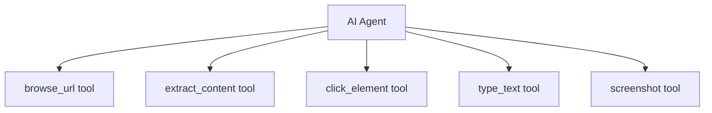

# Web Browsing Skills for AI Agents

Web browsing is one of the most powerful skills an agent can have. It enables real-time information access, form filling, and interaction with web applications. This guide covers best practices for implementing robust web browsing capabilities.

## Browser Automation Options

### Comparison

| Tool | Language | Headless | Speed | Best For |
| :--- | :--- | :--- | :--- | :--- |
| **Playwright** | Python/JS/C# | ✅ | Fast | Modern, full-featured |
| **Puppeteer** | JavaScript | ✅ | Fast | Chrome-specific |
| **Selenium** | Many | ✅ | Slow | Legacy, broad browser support |
| **requests + BeautifulSoup** | Python | N/A | Fastest | Static pages only |

**Recommendation**: Use Playwright for new projects.

---

## Playwright Basics

### Installation

```bash
pip install playwright
playwright install  # Downloads browser binaries
```

### Basic Navigation

```python
from playwright.sync_api import sync_playwright

with sync_playwright() as p:
    browser = p.chromium.launch(headless=True)
    page = browser.new_page()
    
    # Navigate
    page.goto("https://example.com")
    
    # Get content
    content = page.content()  # Full HTML
    text = page.inner_text("body")  # Visible text only
    
    # Screenshot for debugging
    page.screenshot(path="screenshot.png")
    
    browser.close()
```

### Async Version (Recommended)

```python
import asyncio
from playwright.async_api import async_playwright

async def browse(url: str) -> str:
    async with async_playwright() as p:
        browser = await p.chromium.launch(headless=True)
        page = await browser.new_page()
        await page.goto(url)
        content = await page.content()
        await browser.close()
        return content

# Run
result = asyncio.run(browse("https://example.com"))
```

---

## Content Extraction Strategies

### 1. Readability Mode

Convert messy HTML to clean, readable content:

```python
from readability import Document
import requests

html = requests.get(url).text
doc = Document(html)

title = doc.title()
content = doc.summary()  # Main content only
```

### 2. HTML to Markdown

LLMs work better with markdown than raw HTML:

```python
import html2text

converter = html2text.HTML2Text()
converter.ignore_links = False
converter.ignore_images = True
converter.body_width = 0  # No wrapping

markdown = converter.handle(html_content)
```

### 3. Targeted Extraction

For known sites, extract specific elements:

```python
# Get all article titles
titles = page.locator("article h2").all_text_contents()

# Get table data
rows = page.locator("table tr").all()
data = []
for row in rows:
    cells = row.locator("td").all_text_contents()
    data.append(cells)
```

### 4. Structured Data (JSON-LD)

Many sites embed structured data:

```python
import json

scripts = page.locator('script[type="application/ld+json"]').all()
structured_data = []
for script in scripts:
    content = script.inner_text()
    structured_data.append(json.loads(content))
```

---

## Handling Dynamic Content

### Wait for Content

```python
# Wait for specific element
await page.wait_for_selector(".search-results")

# Wait for network idle
await page.goto(url, wait_until="networkidle")

# Wait for custom condition
await page.wait_for_function("window.dataLoaded === true")
```

### Infinite Scroll

```python
async def scroll_to_bottom(page, max_scrolls=10):
    for _ in range(max_scrolls):
        previous_height = await page.evaluate("document.body.scrollHeight")
        await page.evaluate("window.scrollTo(0, document.body.scrollHeight)")
        await page.wait_for_timeout(1000)  # Wait for content to load
        
        new_height = await page.evaluate("document.body.scrollHeight")
        if new_height == previous_height:
            break  # No more content
```

### Click to Load More

```python
while True:
    try:
        load_more = page.locator("button:has-text('Load More')")
        if await load_more.is_visible():
            await load_more.click()
            await page.wait_for_timeout(1000)
        else:
            break
    except:
        break
```

---

## Agent Integration Pattern



### Tool Definitions

```python
tools = [
    {
        "name": "browse_url",
        "description": "Navigate to a URL and get the page content as markdown",
        "parameters": {
            "type": "object",
            "properties": {
                "url": {"type": "string", "description": "URL to navigate to"}
            },
            "required": ["url"]
        }
    },
    {
        "name": "click_element",
        "description": "Click on an element identified by CSS selector or text",
        "parameters": {
            "type": "object",
            "properties": {
                "selector": {"type": "string", "description": "CSS selector or text content"}
            },
            "required": ["selector"]
        }
    },
    {
        "name": "type_text",
        "description": "Type text into an input field",
        "parameters": {
            "type": "object",
            "properties": {
                "selector": {"type": "string"},
                "text": {"type": "string"}
            },
            "required": ["selector", "text"]
        }
    },
    {
        "name": "screenshot",
        "description": "Take a screenshot of the current page",
        "parameters": {"type": "object", "properties": {}}
    }
]
```

### Implementation

```python
class BrowserAgent:
    def __init__(self):
        self.playwright = None
        self.browser = None
        self.page = None
    
    async def start(self):
        self.playwright = await async_playwright().start()
        self.browser = await self.playwright.chromium.launch(headless=True)
        self.page = await self.browser.new_page()
    
    async def browse_url(self, url: str) -> str:
        await self.page.goto(url, wait_until="domcontentloaded")
        html = await self.page.content()
        return html_to_markdown(html)
    
    async def click_element(self, selector: str) -> str:
        await self.page.click(selector)
        await self.page.wait_for_timeout(500)
        return f"Clicked: {selector}"
    
    async def type_text(self, selector: str, text: str) -> str:
        await self.page.fill(selector, text)
        return f"Typed '{text}' into {selector}"
    
    async def screenshot(self) -> bytes:
        return await self.page.screenshot()
    
    async def close(self):
        await self.browser.close()
        await self.playwright.stop()
```

---

## Dealing with Anti-Bot Measures

### 1. User Agent & Headers

```python
context = await browser.new_context(
    user_agent="Mozilla/5.0 (Windows NT 10.0; Win64; x64) AppleWebKit/537.36",
    extra_http_headers={
        "Accept-Language": "en-US,en;q=0.9",
    }
)
```

### 2. Stealth Mode

```python
from playwright_stealth import stealth_sync

page = browser.new_page()
stealth_sync(page)  # Patches detection methods
```

### 3. Rate Limiting

```python
import asyncio
import random

async def polite_browse(urls: list[str]):
    results = []
    for url in urls:
        result = await browse(url)
        results.append(result)
        # Random delay between 2-5 seconds
        await asyncio.sleep(random.uniform(2, 5))
    return results
```

---

## Best Practices

### 1. Always Set Timeouts

```python
page.set_default_timeout(30000)  # 30 seconds
page.set_default_navigation_timeout(60000)  # 60 seconds for navigation
```

### 2. Handle Errors Gracefully

```python
async def safe_browse(url: str) -> dict:
    try:
        await page.goto(url, timeout=30000)
        return {"success": True, "content": await page.content()}
    except TimeoutError:
        return {"success": False, "error": "Page load timeout"}
    except Exception as e:
        return {"success": False, "error": str(e)}
```

### 3. Limit Content Size

```python
def truncate_for_llm(content: str, max_tokens: int = 4000) -> str:
    """Approximate token count and truncate"""
    # Rough estimate: 1 token ≈ 4 characters
    max_chars = max_tokens * 4
    if len(content) > max_chars:
        return content[:max_chars] + "\n\n[Content truncated...]"
    return content
```

### 4. Clean Up Resources

```python
@contextmanager
def browser_session():
    playwright = sync_playwright().start()
    browser = playwright.chromium.launch()
    page = browser.new_page()
    try:
        yield page
    finally:
        browser.close()
        playwright.stop()
```

---

## Security Considerations

> [!CAUTION]
> Never let agents browse arbitrary URLs in production without safeguards.

### URL Allowlisting

```python
ALLOWED_DOMAINS = ["wikipedia.org", "docs.python.org", "github.com"]

def is_safe_url(url: str) -> bool:
    from urllib.parse import urlparse
    domain = urlparse(url).netloc
    return any(domain.endswith(allowed) for allowed in ALLOWED_DOMAINS)
```

### Sandbox Isolation

Run browser in Docker container:

```dockerfile
FROM mcr.microsoft.com/playwright/python:v1.40.0-jammy
# Browser cannot access host network or filesystem
```

---

## Conclusion

Web browsing gives agents powerful real-time capabilities. Start with read-only browsing (content extraction), then carefully add interactive features (clicking, form filling) with proper security controls.

---
*Related: [Tool Use & Function Calling](./tool-use-function-calling) | [Agent Skills Guide](./agent-skills-guide)*
